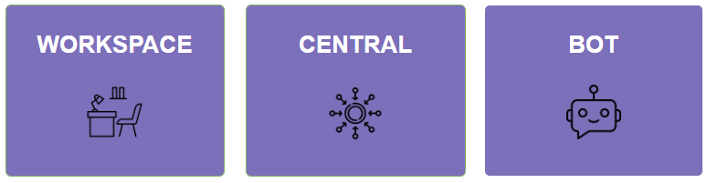

Components Overview
===================

This segment provides and overview of DD Robotics Process Automation
components.

|image1|

Workspace

The Workspace is an all-encompassing design platform that enables users
to quickly and easily construct automation projects that span one or
more of the services offered by the DD RPA Automation Platform. The
Workplace has an extensive user interface with drag-and-drop
capabilities that enable the user to create an entire automation project
with little to no coding experience.

Central

The Central is a scheduling engine which determines which automation
projects to run and when it need to run at target system. Through REST
API, the Central coordinates with the RPA Bot to carry out tasks and
keep an eye out for occurrences and errors.

Bot

A DD Bot is an essential component in DD RPA Ecosystem. It is an agent
which is placed on a Desktop or Workstation that can manage one or more
unattended bot operation depending on the situation. The assigned tasks
are carried out, and the task's progress is tracked and reported to
Central Server for evaluation.

