Workspace
=========

Run and open Workspace
----------------------

1. Go to the folder “vlatest” with the file path
   “C:\\DDRPA\\Workspace\\vlatest”.

2. Double click on the “RPADesigner.exe” to run it.

3. A command prompt will appear, minimize it.

4. Go to the Workspace website ( http://localhost:5000/fetch-project ).

Create new project
------------------

1. Click on the “Create New Project” button located on the top left side
   of the website.

..

   |image1|

2. A new project will be created under the “Create New Project” button.
   Enter a name into the text field and press “enter”..

..

   |image2|

3. Click on the newly created project once to show its content. Hover
   the mouse over the project and click the “+” button that is on the
   right of the project name.

..

   |image3|

4. Enter the new folder’s name in the text field and press “enter”

..

   |image4|

5. Click on the “New Workspace” button to create a new workspace.

..

   |image5|

Create workflow
---------------

|image6|

+----+---------+------------------------------------------------------+
| 1. | File    | File name that you are editing.                      |
|    | Name    |                                                      |
+----+---------+------------------------------------------------------+
| 2. | P       | Projects & Files that you created.                   |
|    | rojects |                                                      |
|    | & Files |                                                      |
+----+---------+------------------------------------------------------+
| 3. | Action  | Different automation’s actions.                      |
|    | Bar     |                                                      |
+----+---------+------------------------------------------------------+
| 4. | Canvas  | Drag a required action from the action bar to the    |
|    |         | canvas to start your automation.                     |
+----+---------+------------------------------------------------------+
| 5. | Buttons | Export                                               |
|    |         |                                                      |
|    |         | Export current canvas file as ddp file and use this  |
|    |         | ddp file to schedule on central.                     |
|    |         |                                                      |
|    |         | Undo                                                 |
|    |         |                                                      |
|    |         | Undo the canvas.                                     |
|    |         |                                                      |
|    |         | Redo                                                 |
|    |         |                                                      |
|    |         | Redo the canvas.                                     |
|    |         |                                                      |
|    |         | Run                                                  |
|    |         |                                                      |
|    |         | Run the actions on canvas.                           |
|    |         |                                                      |
|    |         | Save                                                 |
|    |         |                                                      |
|    |         | Save the actions connected on canvas.                |
|    |         |                                                      |
|    |         | Close                                                |
|    |         |                                                      |
|    |         | Close current canvas.                                |
|    |         |                                                      |
|    |         | Information                                          |
|    |         |                                                      |
|    |         | About the Workspace.                                 |
+----+---------+------------------------------------------------------+

1. Connect two actions by dragging from the yellow circle of the first
   action to the white circle of the second action.

..

   |image7|

2. Repeat the step 1 to 2 until all actions have been added to the
   workflow. Then connect the last action to the “Flow End” action.

3. Click the “save” button to save the workflow. If it is saved
   successfully, the run button and export button will become clickable
   and not grayed out.

..

   |image8|

4. To run the workflow, click the “run” button next to the “save”
   button.

..

   |image9|

5. To export the workflow, click the “export” button and it will be
   exported to a .ddp file.

..

   |image10|

   *Image 10 Export button*

Actions
-------

Web
~~~

These actions are used to perform web actions such as clicking a web
element and accessing a website.

Browser Back
^^^^^^^^^^^^

|image11|

Function: Go to the previous browser page

Browser Forward
^^^^^^^^^^^^^^^

|image12|

Function: Go forward one browser page

Click By XPath
^^^^^^^^^^^^^^

|image13|

Function: Click on a web element using XPath

+---------------------+------------------------------------------------+
| **Parameter**       | **Description**                                |
+---------------------+------------------------------------------------+
| Click Type          | Choose left click, right click, or double      |
|                     | click.                                         |
+---------------------+------------------------------------------------+
| XPATH               | Put the xPath of the web element.              |
+---------------------+------------------------------------------------+

Click Web Element
^^^^^^^^^^^^^^^^^

|image14|

Function: Click on a web element.

+---------------------+------------------------------------------------+
| **Parameter**       | **Description**                                |
+---------------------+------------------------------------------------+
| Element             | Choose the correct Child, Child & Grandchild   |
|                     | for the xPath.                                 |
+---------------------+------------------------------------------------+
| Element Type        | Choose the type of web element.                |
+---------------------+------------------------------------------------+
| Search By           | Choose what xPath you are copying.             |
+---------------------+------------------------------------------------+
| Element Name To     | Put the name to match with the “Search By”.    |
| Match               |                                                |
+---------------------+------------------------------------------------+
| Nth Match Element   | Put the element after the element name.        |
+---------------------+------------------------------------------------+

Double Click Web Element
^^^^^^^^^^^^^^^^^^^^^^^^

|image15|

Function:

+---------------------+------------------------------------------------+
| **Parameter**       | **Description**                                |
+---------------------+------------------------------------------------+
| Element             | Choose the correct Child, Child & Grandchild   |
|                     | for the xPath.                                 |
+---------------------+------------------------------------------------+
| Element Type        | Choose the type of web element.                |
+---------------------+------------------------------------------------+
| Search By           | Choose what xPath you are copying.             |
+---------------------+------------------------------------------------+
| Element Name To     | Put the name to match with the “Search By”.    |
| Match               |                                                |
+---------------------+------------------------------------------------+
| Nth Match Element   | Put the element after the element name.        |
+---------------------+------------------------------------------------+

Download To
^^^^^^^^^^^

|image16|

Function: Declare the path to store downloaded files instead of the
default download folder

+---------------------+------------------------------------------------+
| **Parameter**       | **Description**                                |
+---------------------+------------------------------------------------+
| Folder Location     | To put your folder location that you want the  |
|                     | file to download to.                           |
+---------------------+------------------------------------------------+

Email
^^^^^

|image17|

Function: Send an email using outlook website

+---------------------+------------------------------------------------+
| **Parameter**       | **Description**                                |
+---------------------+------------------------------------------------+
| To                  | The receiver of the email.                     |
+---------------------+------------------------------------------------+
| CC                  | The emails that will receive a cc of the       |
|                     | email.                                         |
+---------------------+------------------------------------------------+
| Subject             | The subject of the email.                      |
+---------------------+------------------------------------------------+
| Body                | The body of the email.                         |
+---------------------+------------------------------------------------+

Read web Element
^^^^^^^^^^^^^^^^

|image18|

Function: To read the text of the web element.

+---------------------+------------------------------------------------+
| **Parameter**       | **Description**                                |
+---------------------+------------------------------------------------+
| Element             | Choose the correct Child, Child & Grandchild   |
|                     | for the xPath.                                 |
+---------------------+------------------------------------------------+
| Element Type        | Choose the type of web element.                |
+---------------------+------------------------------------------------+
| Search By           | Choose what xPath you are copying.             |
+---------------------+------------------------------------------------+
| Element Name To     | Put the name to match with the “Search By”.    |
| Match               |                                                |
+---------------------+------------------------------------------------+
| Nth Match Element   | Put the element after the element name.        |
+---------------------+------------------------------------------------+
| Variable to store   | The variable that will store the text.         |
+---------------------+------------------------------------------------+

Read Xpath
^^^^^^^^^^

|image19|

Function: Read the text on specific XPATH

+---------------------+------------------------------------------------+
| **Parameter**       | **Description**                                |
+---------------------+------------------------------------------------+
| XPATH               | The XPath of the element.                      |
+---------------------+------------------------------------------------+
| Out                 | The variable to store the text.                |
+---------------------+------------------------------------------------+

Refresh Web Page
^^^^^^^^^^^^^^^^

|image20|

Function: To refresh the website, same as pressing the refresh function
(F5)

Save Table
^^^^^^^^^^

|image21|

Function: Save the html table data to csv file.

+---------------------+------------------------------------------------+
| **Parameter**       | **Description**                                |
+---------------------+------------------------------------------------+
| Table XPATH         | The XPath of the html table.                   |
+---------------------+------------------------------------------------+
| CSV Filename        | The file path of the csv file.                 |
+---------------------+------------------------------------------------+

Set Web Wait Timeout
^^^^^^^^^^^^^^^^^^^^

|image22|

Function: Set the wait timeout for the website

+---------------------+------------------------------------------------+
| **Parameter**       | **Description**                                |
+---------------------+------------------------------------------------+
| Second to wait      | The number of seconds to wait before timeout.  |
+---------------------+------------------------------------------------+

Type On Element
^^^^^^^^^^^^^^^

|image23|

Function: To type text on a web element

+---------------------+------------------------------------------------+
| **Parameter**       | **Description**                                |
+---------------------+------------------------------------------------+
| Element Name        | The name of the element to be typed on.        |
+---------------------+------------------------------------------------+
| Text                | The text to be typed .                         |
+---------------------+------------------------------------------------+
| Followed by ENTER   | Should the text be followed by enter key.      |
+---------------------+------------------------------------------------+

Type Web Element
^^^^^^^^^^^^^^^^

|image24|

Function: To type text on a web element

+---------------------+------------------------------------------------+
| **Parameter**       | **Description**                                |
+---------------------+------------------------------------------------+
| Element             | Choose the correct Child, Child & Grandchild   |
|                     | for the xPath.                                 |
+---------------------+------------------------------------------------+
| Element Type        | Choose the type of web element.                |
+---------------------+------------------------------------------------+
| Search By           | Choose what xPath you are copying.             |
+---------------------+------------------------------------------------+
| Element Name To     | Put the name to match with the “Search By”.    |
| Match               |                                                |
+---------------------+------------------------------------------------+
| Nth Match Element   | Put the element after the element name.        |
+---------------------+------------------------------------------------+
| Text                | The text to be typed.                          |
+---------------------+------------------------------------------------+

Upload To
^^^^^^^^^

|image25|

Function: Upload file to the web

+---------------------+------------------------------------------------+
| **Parameter**       | **Description**                                |
+---------------------+------------------------------------------------+
| DOM of upload       | The DOM of the upload element in the website.  |
| element             |                                                |
+---------------------+------------------------------------------------+
| FIlename            | The filepath of the file to be uploaded.       |
+---------------------+------------------------------------------------+

.. _web-1:

Web
^^^

|image26|

Function: Open a website

+---------------------+------------------------------------------------+
| **Parameter**       | **Description**                                |
+---------------------+------------------------------------------------+
| URL                 | The url of the website to be opened.           |
+---------------------+------------------------------------------------+

Web API
^^^^^^^

|image27|

Function:

+---------------------+------------------------------------------------+
| **Parameter**       | **Description**                                |
+---------------------+------------------------------------------------+
| Login URL           |                                                |
+---------------------+------------------------------------------------+
| Username            |                                                |
+---------------------+------------------------------------------------+
| Password            |                                                |
+---------------------+------------------------------------------------+
| WT Token Name       |                                                |
+---------------------+------------------------------------------------+
| Web API URL         |                                                |
+---------------------+------------------------------------------------+
| Output              |                                                |
+---------------------+------------------------------------------------+

Mouse & Keyboard
~~~~~~~~~~~~~~~~

Bring Focus (Not included in the download)
^^^^^^^^^^^^^^^^^^^^^^^^^^^^^^^^^^^^^^^^^^

|image28|

Function: To bring an opened window to the front and set focus on the
window

+---------------------+------------------------------------------------+
| **Parameter**       | **Description**                                |
+---------------------+------------------------------------------------+
| Window Name         | The name of the window to be focused on.       |
+---------------------+------------------------------------------------+

Click UI
^^^^^^^^

|image29|

Function: Click the UI at specific location

+---------------------+------------------------------------------------+
| **Parameter**       | **Description**                                |
+---------------------+------------------------------------------------+
| Click Type          | Select whether to left click, right click or   |
|                     | double-click.                                  |
+---------------------+------------------------------------------------+
| X coordinate        | X coordinate of the target on screen.          |
+---------------------+------------------------------------------------+
| Y coordinate        | Y coordinate of the target on screen.          |
+---------------------+------------------------------------------------+

Click UI By Image
^^^^^^^^^^^^^^^^^

|image30|

Function: Click the UI based on image

+---------------------+------------------------------------------------+
| **Parameter**       | **Description**                                |
+---------------------+------------------------------------------------+
| Click Type          | Select whether to left click, right click or   |
|                     | double-click.                                  |
+---------------------+------------------------------------------------+
| Image               | The image of the UI to be clicked.             |
+---------------------+------------------------------------------------+

Close Application
^^^^^^^^^^^^^^^^^

|image31|

Function: To close the current window

Hover UI
^^^^^^^^

|image32|

Function: Hover the mouse over the UI at a specific location

+---------------------+------------------------------------------------+
| **Parameter**       | **Description**                                |
+---------------------+------------------------------------------------+
| X coordinate        | X coordinate of the target on screen.          |
+---------------------+------------------------------------------------+
| Y coordinate        | Y coordinate of the target on screen.          |
+---------------------+------------------------------------------------+

Hover UI By Image
^^^^^^^^^^^^^^^^^

|image33|

Function: Hover the mouse over the UI based on image

+---------------------+------------------------------------------------+
| **Parameter**       | **Description**                                |
+---------------------+------------------------------------------------+
| Image               | The image of the UI to be hover over.          |
+---------------------+------------------------------------------------+

Keyboard
^^^^^^^^

|image34|

Function: Input of keyboard special key.

+---------------------+------------------------------------------------+
| **Parameter**       | **Description**                                |
+---------------------+------------------------------------------------+
| Keys                | A selection of special keystroke such as       |
|                     | spacebar and alt.                              |
+---------------------+------------------------------------------------+

Keyboard Input
^^^^^^^^^^^^^^

|image35|

Function: Input of text or combination of keystroke.

+---------------------+------------------------------------------------+
| **Parameter**       | **Description**                                |
+---------------------+------------------------------------------------+
| Input               | The text that will be typed.                   |
+---------------------+------------------------------------------------+

Keyboard Type Input
^^^^^^^^^^^^^^^^^^^

|image36|

Function: To input a sentence

+---------------------+------------------------------------------------+
| **Parameter**       | **Description**                                |
+---------------------+------------------------------------------------+
| Text                | The sentences of text to be input.             |
+---------------------+------------------------------------------------+

OCR - Click
^^^^^^^^^^^

|image37|

Function: Using OCR to click on a string of text

+---------------------+------------------------------------------------+
| **Parameter**       | **Description**                                |
+---------------------+------------------------------------------------+
| Click Type          | Select whether to left click, right click or   |
|                     | double-click.                                  |
+---------------------+------------------------------------------------+
| Search String On    | The string of text to be searched for using    |
| Screen              | OCR.                                           |
+---------------------+------------------------------------------------+

Open Application
^^^^^^^^^^^^^^^^

|image38|

Function: To open an application in the computer

+---------------------+------------------------------------------------+
| **Parameter**       | **Description**                                |
+---------------------+------------------------------------------------+
| Application Name    | The name of the application to be opened.      |
+---------------------+------------------------------------------------+

Open File
^^^^^^^^^

|image39|

Function: To open a file of an application

+---------------------+------------------------------------------------+
| **Parameter**       | **Description**                                |
+---------------------+------------------------------------------------+
| Application Name    | The name of the application.                   |
+---------------------+------------------------------------------------+
| File Path           | The file path of the file.                     |
+---------------------+------------------------------------------------+

Save File
^^^^^^^^^

|image40|

Function: To save the file

+---------------------+------------------------------------------------+
| **Parameter**       | **Description**                                |
+---------------------+------------------------------------------------+
| File Name           | The name of the saved file.                    |
+---------------------+------------------------------------------------+

Set Focus
^^^^^^^^^

|image41|

Function: To modify an opened window

+---------------------+------------------------------------------------+
| **Parameter**       | **Description**                                |
+---------------------+------------------------------------------------+
| Windows Name        | The name of the window.                        |
+---------------------+------------------------------------------------+
| Mode                | Choose to restore, maximize or minimize the    |
|                     | window.                                        |
+---------------------+------------------------------------------------+

Windows Run
^^^^^^^^^^^

|image42|

Function: To open the Run Window

Excel Interop
~~~~~~~~~~~~~

Close Work Sheet
^^^^^^^^^^^^^^^^

|image43|

Function: To close an opened worksheet

+---------------------+------------------------------------------------+
| **Parameter**       | **Description**                                |
+---------------------+------------------------------------------------+
| Excel File          | The name of the excel file.                    |
+---------------------+------------------------------------------------+
| Sheet name          | The name of the worksheet.                     |
+---------------------+------------------------------------------------+
| Save                | An option to save or not save the worksheet.   |
+---------------------+------------------------------------------------+

Copy Data
^^^^^^^^^

|image44|

Function: To copy a range of data from one excel sheet to another

+---------------------+------------------------------------------------+
| **Parameter**       | **Description**                                |
+---------------------+------------------------------------------------+
| Source Excel        | The path of the source excel.                  |
| Filename            |                                                |
+---------------------+------------------------------------------------+
| Source Sheet        | The name of the source excel sheet.            |
+---------------------+------------------------------------------------+
| Cell Range          | The range of data to be copied.                |
+---------------------+------------------------------------------------+
| Target Excel        | The path of the target excel.                  |
| FIlename            |                                                |
+---------------------+------------------------------------------------+
| Target SHeet        | The name of the target excel sheet.            |
+---------------------+------------------------------------------------+
| Starting Cell       | The first cell to start pasting the copied     |
|                     | data.                                          |
+---------------------+------------------------------------------------+

Copy Excel
^^^^^^^^^^

|image45|

Function: Copy the range of data from one excel sheet to another. (The
file needs to be uploaded to the DD RPA workspace)

+---------------------+------------------------------------------------+
| **Parameter**       | **Description**                                |
+---------------------+------------------------------------------------+
| Source File         | The name of the source file.                   |
+---------------------+------------------------------------------------+
| Source Sheet        | The sheet name of the source excel file.       |
+---------------------+------------------------------------------------+
| Start Source        | The starting cell to copy the data.            |
+---------------------+------------------------------------------------+
| End Source          | The ending cell to copy the data.              |
+---------------------+------------------------------------------------+
| Destination File    | The name of the destination file.              |
+---------------------+------------------------------------------------+
| Destination Sheet   | The name of the destination excel file.        |
+---------------------+------------------------------------------------+
| Start Destination   | The starting cell to paste the data.           |
+---------------------+------------------------------------------------+
| End Destination     | The ending cell to paste the data.             |
+---------------------+------------------------------------------------+

Copy Excel Path
^^^^^^^^^^^^^^^

|image46|

Function: Copy a range of data from one excel sheet to another. (Using
the file path of the excel file that is located in the device)

+---------------------+------------------------------------------------+
| **Parameter**       | **Description**                                |
+---------------------+------------------------------------------------+
| Source File         | The name of the source file .                  |
+---------------------+------------------------------------------------+
| Source Sheet        | The sheet name of the source excel file.       |
+---------------------+------------------------------------------------+
| Start Source        | The starting cell to copy the data.            |
+---------------------+------------------------------------------------+
| End Source          | The ending cell to copy the data.              |
+---------------------+------------------------------------------------+
| Destination File    | The name of the destination file.              |
+---------------------+------------------------------------------------+
| Destination Sheet   | The name of the destination excel file.        |
+---------------------+------------------------------------------------+
| Start Destination   | The starting cell to paste the data.           |
+---------------------+------------------------------------------------+
| End Destination     | The ending cell to paste the data.             |
+---------------------+------------------------------------------------+

Delete Excel Data
^^^^^^^^^^^^^^^^^

|image47|

Function: Delete data in an excel sheet

+---------------------+------------------------------------------------+
| **Parameter**       | **Description**                                |
+---------------------+------------------------------------------------+
| FileName            | The name of the excel file.                    |
+---------------------+------------------------------------------------+
| SHeet Name          | The name of the excel sheet.                   |
+---------------------+------------------------------------------------+
| Start Row-Column    | The first cell of data.                        |
+---------------------+------------------------------------------------+
| End Row-Column      | The last cell of data.                         |
+---------------------+------------------------------------------------+

Open Excel
^^^^^^^^^^

|image48|

Function: Open an excel file

+---------------------+------------------------------------------------+
| **Parameter**       | **Description**                                |
+---------------------+------------------------------------------------+
| File Path           | The file path of the excel file to be opened.  |
+---------------------+------------------------------------------------+

Read Excel
^^^^^^^^^^

|image49|

Function: To read a range of data into a data array

+---------------------+------------------------------------------------+
| **Parameter**       | **Description**                                |
+---------------------+------------------------------------------------+
| Excel Filename      | The file path of the excel file.               |
+---------------------+------------------------------------------------+
| Sheetname           | The name of the excel sheet.                   |
+---------------------+------------------------------------------------+
| Range               | The range of data to be read.                  |
+---------------------+------------------------------------------------+
| Data Array          | The data array variable to store the data.     |
+---------------------+------------------------------------------------+

Read Excel Rows
^^^^^^^^^^^^^^^

|image50|

Function: Read a row of data into a variable

+---------------------+------------------------------------------------+
| **Parameter**       | **Description**                                |
+---------------------+------------------------------------------------+
| Variable            | THe variable to store the data.                |
+---------------------+------------------------------------------------+
| File Name           | The name of the excel file.                    |
+---------------------+------------------------------------------------+
| Sheet Name          | The name of the excel sheet.                   |
+---------------------+------------------------------------------------+
| Start Column        | The first column of the data range.            |
+---------------------+------------------------------------------------+
| End Column          | The last column of the data range.             |
+---------------------+------------------------------------------------+

Write Excel
^^^^^^^^^^^

|image51|

Function: To write a data array into an excel sheet

+---------------------+------------------------------------------------+
| **Parameter**       | **Description**                                |
+---------------------+------------------------------------------------+
| Excel FIlename      | The file path of the excel file.               |
+---------------------+------------------------------------------------+
| Sheetname           | The name of the excel sheet.                   |
+---------------------+------------------------------------------------+
| Starting Cell       | The first cell to start writing the data.      |
+---------------------+------------------------------------------------+
| Data Array          | The data array that will be used to write into |
|                     | the excel.                                     |
+---------------------+------------------------------------------------+

Excel
~~~~~

Add Column
^^^^^^^^^^

|image52|

Function: This function is to add columns in the excel file. It will use
the insert column function of excel.

+---------------------+------------------------------------------------+
| **Parameter**       | **Description**                                |
+---------------------+------------------------------------------------+
| Excel Filename      | The file path of the excel file.               |
+---------------------+------------------------------------------------+
| Sheetname           | The name of the excel sheet.                   |
+---------------------+------------------------------------------------+
| Column Start        | The starting column to add new columns.        |
+---------------------+------------------------------------------------+
| Count               | The number of columns to be added.             |
+---------------------+------------------------------------------------+

Add New Sheet
^^^^^^^^^^^^^

|image53|

Function: This function is to add a new sheet to an excel file.

+---------------------+------------------------------------------------+
| **Parameter**       | **Description**                                |
+---------------------+------------------------------------------------+
| Excel Filename      | The file path of the excel file.               |
+---------------------+------------------------------------------------+
| Sheetname           | The name of the new sheet to be added.         |
+---------------------+------------------------------------------------+

Add Row
^^^^^^^

|image54|

Function: This function is to add rows in the excel file. It will use
the insert row function of excel.

+---------------------+------------------------------------------------+
| **Parameter**       | **Description**                                |
+---------------------+------------------------------------------------+
| Excel Filename      | The file path of the excel file.               |
+---------------------+------------------------------------------------+
| Sheetname           | The name of the excel sheet.                   |
+---------------------+------------------------------------------------+
| Row Start           | The starting row to add new rows.              |
+---------------------+------------------------------------------------+
| Count               | The number of rows to be added.                |
+---------------------+------------------------------------------------+

Cell Format
^^^^^^^^^^^

|image55|

Function: This function is to set the format for a range of cells in an
excel file.

+---------------------+------------------------------------------------+
| **Parameter**       | **Description**                                |
+---------------------+------------------------------------------------+
| Excel FIlename      | The file path of the excel file.               |
+---------------------+------------------------------------------------+
| Sheetname           | The name of the excel sheet.                   |
+---------------------+------------------------------------------------+
| Cell Start          | The first cell of the cell range.              |
+---------------------+------------------------------------------------+
| Cell End            | THe last cell of the cell range.               |
+---------------------+------------------------------------------------+
| Cell Format         | The format to be set for the cell range.       |
+---------------------+------------------------------------------------+

Clear Sheet
^^^^^^^^^^^

|image56|

Function: This function is to clear the cell in an excel sheet.

+---------------------+------------------------------------------------+
| **Parameter**       | **Description**                                |
+---------------------+------------------------------------------------+
| Excel Filename      | The file path of the excel file.               |
+---------------------+------------------------------------------------+
| Sheetname           | The name of the excel sheet.                   |
+---------------------+------------------------------------------------+
| Cell Start          | The first cell of the cell range.              |
+---------------------+------------------------------------------------+
| Cell End            | The last cell of the cell range.               |
+---------------------+------------------------------------------------+

Color Cell
^^^^^^^^^^

|image57|

Function: This function is to color the cell in an excel file.

+---------------------+------------------------------------------------+
| **Parameter**       | **Description**                                |
+---------------------+------------------------------------------------+
| Excel Filename      | The file path of the excel file.               |
+---------------------+------------------------------------------------+
| Sheetname           | The name of the excel sheet.                   |
+---------------------+------------------------------------------------+
| Cell Start          | The first cell of the cell range.              |
+---------------------+------------------------------------------------+
| Cell End            | The last cell of the cell range.               |
+---------------------+------------------------------------------------+
| Color               | The color to be set for the cell range.        |
+---------------------+------------------------------------------------+

Delete Column
^^^^^^^^^^^^^

|image58|

Function: This function is to delete columns in the excel file.

+---------------------+------------------------------------------------+
| **Parameter**       | **Description**                                |
+---------------------+------------------------------------------------+
| Excel Filename      | The file path of the excel file.               |
+---------------------+------------------------------------------------+
| Sheetname           | The name of the excel sheet.                   |
+---------------------+------------------------------------------------+
| Column Start        | The first column to be deleted.                |
+---------------------+------------------------------------------------+
| Count               | The number of columns to be deleted.           |
+---------------------+------------------------------------------------+

Delete Row
^^^^^^^^^^

|image59|

Function: This function is to delete rows in the excel file.

+---------------------+------------------------------------------------+
| **Parameter**       | **Description**                                |
+---------------------+------------------------------------------------+
| Excel Filename      | The file path of the excel file.               |
+---------------------+------------------------------------------------+
| Sheetname           | The name of the excel sheet.                   |
+---------------------+------------------------------------------------+
| Row Start           | The first row to be deleted.                   |
+---------------------+------------------------------------------------+
| Count               | The number of rows to be deleted.              |
+---------------------+------------------------------------------------+

Delete Sheet
^^^^^^^^^^^^

|image60|

Function: This function is to delete a sheet of an excel file.

+---------------------+------------------------------------------------+
| **Parameter**       | **Description**                                |
+---------------------+------------------------------------------------+
| Excel Filename      | The file path of the excel file.               |
+---------------------+------------------------------------------------+
| Sheetname           | The name of the excel sheet.                   |
+---------------------+------------------------------------------------+

Import Data By Column
^^^^^^^^^^^^^^^^^^^^^

|image61|

Function: Import entire column from one excel sheet to another

+---------------------+------------------------------------------------+
| **Parameter**       | **Description**                                |
+---------------------+------------------------------------------------+
| Source Excel        | The file path of the source excel file.        |
| Filename            |                                                |
+---------------------+------------------------------------------------+
| Sheetname           | THe name of the source excel sheet.            |
+---------------------+------------------------------------------------+
| Column              | The column to be copied.                       |
+---------------------+------------------------------------------------+
| Headers             | An option to import the headers or not.        |
+---------------------+------------------------------------------------+
| Target Excel        | The file path of the target excel file.        |
| Filename            |                                                |
+---------------------+------------------------------------------------+
| Sheetname           | The name of the target excel sheet.            |
+---------------------+------------------------------------------------+
| Column              | The column to import the data.                 |
+---------------------+------------------------------------------------+

Insert Formula
^^^^^^^^^^^^^^

|image62|

Function: To insert formula to a row of cells

+---------------------+------------------------------------------------+
| **Parameter**       | **Description**                                |
+---------------------+------------------------------------------------+
| Excel Filename      | The file path of the excel file.               |
+---------------------+------------------------------------------------+
| Sheetname           | The name of the excel sheet.                   |
+---------------------+------------------------------------------------+
| Starting Column     | The column of the first cell.                  |
+---------------------+------------------------------------------------+
| Starting Row        | The row of the first cell.                     |
+---------------------+------------------------------------------------+
| Rows                | The number of rows after the first cell.       |
+---------------------+------------------------------------------------+
| Formula             | The formula to be inserted into the cell       |
|                     | range.                                         |
+---------------------+------------------------------------------------+

Merge Cell
^^^^^^^^^^

|image63|

Function: To merge two or more cells together

+---------------------+------------------------------------------------+
| **Parameter**       | **Description**                                |
+---------------------+------------------------------------------------+
| Excel FIlename      | The file path of the excel file.               |
+---------------------+------------------------------------------------+
| Sheetname           | The name of the excel sheet.                   |
+---------------------+------------------------------------------------+
| Cell Start          | The first cell of the cell range.              |
+---------------------+------------------------------------------------+
| Cell End            | The last cell of the cell range.               |
+---------------------+------------------------------------------------+
| Text                | Th text to be written into the merged cell.    |
+---------------------+------------------------------------------------+
| Alignment           | The text alignment of the merged cell.         |
+---------------------+------------------------------------------------+
| Bold                | An option to make the text bold.               |
+---------------------+------------------------------------------------+
| Italic              | An option to make the text italic.             |
+---------------------+------------------------------------------------+

Remove Duplicates
^^^^^^^^^^^^^^^^^

|image64|

Function: To remove all duplicates in the same column

+---------------------+------------------------------------------------+
| **Parameter**       | **Description**                                |
+---------------------+------------------------------------------------+
| Excel Filename      | The file path of the excel file.               |
+---------------------+------------------------------------------------+
| Sheetname           | The name of the excel sheet.                   |
+---------------------+------------------------------------------------+
| Column              | THe column to remove duplicates.               |
+---------------------+------------------------------------------------+
| Headers             | An option for if there is a header or not.     |
+---------------------+------------------------------------------------+

Rename Sheet
^^^^^^^^^^^^

|image65|

Function: To rename an existing sheet

+---------------------+------------------------------------------------+
| **Parameter**       | **Description**                                |
+---------------------+------------------------------------------------+
| Excel FIlename      | The file path of the excel file.               |
+---------------------+------------------------------------------------+
| Sheetname           | The name of the excel sheet.                   |
+---------------------+------------------------------------------------+
| New Sheetname       | The new name of the excel sheet.               |
+---------------------+------------------------------------------------+

Write To Cell
^^^^^^^^^^^^^

|image66|

Function: To write data to a cell

+---------------------+------------------------------------------------+
| **Parameter**       | **Description**                                |
+---------------------+------------------------------------------------+
| Excel FIlename      | The file path of the excel file.               |
+---------------------+------------------------------------------------+
| Sheetname           | The name of the excel sheet.                   |
+---------------------+------------------------------------------------+
| Cell                | The cell to write the data.                    |
+---------------------+------------------------------------------------+
| Value               | The value to be written to the cell.           |
+---------------------+------------------------------------------------+
| Type                | The type of the value.                         |
+---------------------+------------------------------------------------+

File/Saving
~~~~~~~~~~~

Copy Move File
^^^^^^^^^^^^^^

|image67|

Function: To copy or move a file

+---------------------+------------------------------------------------+
| **Parameter**       | **Description**                                |
+---------------------+------------------------------------------------+
| Source File         | The file path of the source file.              |
+---------------------+------------------------------------------------+
| Target File         | The file path of the target file.              |
+---------------------+------------------------------------------------+
| Operation           | An option to copy or move the source file.     |
+---------------------+------------------------------------------------+
| Replace             | An option to replace the existing file in the  |
|                     | destination path.                              |
+---------------------+------------------------------------------------+

Delete File
^^^^^^^^^^^

|image68|

Function: To delete an existing file.

+---------------------+------------------------------------------------+
| **Parameter**       | **Description**                                |
+---------------------+------------------------------------------------+
| File Path           | The file path of the file to be deleted.       |
+---------------------+------------------------------------------------+

Move Rename File
^^^^^^^^^^^^^^^^

|image69|

Function: To rename or move the file.

+---------------------+------------------------------------------------+
| **Parameter**       | **Description**                                |
+---------------------+------------------------------------------------+
| Source              | The file path of the source file.              |
+---------------------+------------------------------------------------+
| Destination         | The file path of the destination.              |
+---------------------+------------------------------------------------+

Read File
^^^^^^^^^

|image70|

Function: To read a file and store it in a variable

+---------------------+------------------------------------------------+
| **Parameter**       | **Description**                                |
+---------------------+------------------------------------------------+
| Variable            | The variable to store the data.                |
+---------------------+------------------------------------------------+
| Path                | The file path of the file to be read.          |
+---------------------+------------------------------------------------+

Read FIle To
^^^^^^^^^^^^

|image71|

Function: To read a file and store it in a variable

+---------------------+------------------------------------------------+
| **Parameter**       | **Description**                                |
+---------------------+------------------------------------------------+
| Filename            | The file path of the file to be read.          |
+---------------------+------------------------------------------------+
| Out                 | The variable to store the data.                |
+---------------------+------------------------------------------------+

Rename FIle
^^^^^^^^^^^

|image72|

Function: To rename a file

+---------------------+------------------------------------------------+
| **Parameter**       | **Description**                                |
+---------------------+------------------------------------------------+
| Source File         | The file path of the source file.              |
+---------------------+------------------------------------------------+
| Target Filename     | The new file name.                             |
+---------------------+------------------------------------------------+
| Replace             | An option to replace if another file with the  |
|                     | same name exists.                              |
+---------------------+------------------------------------------------+

Write FIle
^^^^^^^^^^

|image73|

Function: To write data to a file

+---------------------+------------------------------------------------+
| **Parameter**       | **Description**                                |
+---------------------+------------------------------------------------+
| Path                | The file path of the file.                     |
+---------------------+------------------------------------------------+
| Content             | The data to be written to the file.            |
+---------------------+------------------------------------------------+

Write To File
^^^^^^^^^^^^^

|image74|

Function: To write data to a file

+---------------------+------------------------------------------------+
| **Parameter**       | **Description**                                |
+---------------------+------------------------------------------------+
| Filename            | The file path of the file.                     |
+---------------------+------------------------------------------------+
| Content             | The data to be written to the file.            |
+---------------------+------------------------------------------------+
| Option              | An option to append or replace the data inside |
|                     | the file.                                      |
+---------------------+------------------------------------------------+

Helper Function
~~~~~~~~~~~~~~~

Close Window
^^^^^^^^^^^^

|image75|

Function: To close the currently opened window

Copy Text
^^^^^^^^^

|image76|

Function: To copy text to the clipboard

+---------------------+------------------------------------------------+
| **Parameter**       | **Description**                                |
+---------------------+------------------------------------------------+
| Text                | The text to be copied.                         |
+---------------------+------------------------------------------------+

Paste Text
^^^^^^^^^^

|image77|

Function: To paste the text in the clipboard

Run CMD
^^^^^^^

|image78|

Function: To run a cmd command

+---------------------+------------------------------------------------+
| **Parameter**       | **Description**                                |
+---------------------+------------------------------------------------+
| Command             | The cmd command to be run.                     |
+---------------------+------------------------------------------------+
| Out                 | The variable to store the output.              |
+---------------------+------------------------------------------------+

Run JS
^^^^^^

|image79|

Function: To run a JavaScript code

+---------------------+------------------------------------------------+
| **Parameter**       | **Description**                                |
+---------------------+------------------------------------------------+
| Script              | The JavaScript code to be run.                 |
+---------------------+------------------------------------------------+
| Out                 | The variable to store the output.              |
+---------------------+------------------------------------------------+

Run Python
^^^^^^^^^^

|image80|

Function: To run a Python code

+---------------------+------------------------------------------------+
| **Parameter**       | **Description**                                |
+---------------------+------------------------------------------------+
| Script              | The Python code to be run.                     |
+---------------------+------------------------------------------------+
| Out                 | The variable to store the output.              |
+---------------------+------------------------------------------------+

Run R
^^^^^

|image81|

Function: To run a R code

+---------------------+------------------------------------------------+
| **Parameter**       | **Description**                                |
+---------------------+------------------------------------------------+
| Script              | The R code to be run.                          |
+---------------------+------------------------------------------------+
| Out                 | The variable to store the output.              |
+---------------------+------------------------------------------------+

Run Sikuli
^^^^^^^^^^

|image82|

Function: To run a Sikuli code

+---------------------+------------------------------------------------+
| **Parameter**       | **Description**                                |
+---------------------+------------------------------------------------+
| Script              | The Sikuli code to be run.                     |
+---------------------+------------------------------------------------+

Set Clipboard
^^^^^^^^^^^^^

|image83|

Function: To set a value to the clipboard

+---------------------+------------------------------------------------+
| **Parameter**       | **Description**                                |
+---------------------+------------------------------------------------+
| Input               | The value to be set to clipboard               |
+---------------------+------------------------------------------------+

Miscellaneous
~~~~~~~~~~~~~

API Basic
^^^^^^^^^

|image84|

Function: Call a web API and save the raw response.

+---------------------+------------------------------------------------+
| **Parameter**       | **Description**                                |
+---------------------+------------------------------------------------+
| URL                 | URL of the API.                                |
+---------------------+------------------------------------------------+
| Out                 | The variable to store the output.              |
+---------------------+------------------------------------------------+

Custom Script
^^^^^^^^^^^^^

|image85|

Function: To make some custom script to run in the flow.

+---------------------+------------------------------------------------+
| **Parameter**       | **Description**                                |
+---------------------+------------------------------------------------+
| Script              | The custom script to be run.                   |
+---------------------+------------------------------------------------+

For Loop
^^^^^^^^

|image86|

Function: Used to repeat a specific action multiple times.

+---------------------+------------------------------------------------+
| **Parameter**       | **Description**                                |
+---------------------+------------------------------------------------+
| Data Array          | The data array to determine the loop count.    |
+---------------------+------------------------------------------------+
| Delimiter           | The delimiter that is used in the data array.  |
+---------------------+------------------------------------------------+

Loop
^^^^

|image87|

Function: To create a loop in the workflow

+---------------------+------------------------------------------------+
| **Parameter**       | **Description**                                |
+---------------------+------------------------------------------------+
| Collection          | The number of loops.                           |
+---------------------+------------------------------------------------+
| Iterator            | The iterator for the loop.                     |
+---------------------+------------------------------------------------+
| Counter             | The counter to be used in the loop.            |
+---------------------+------------------------------------------------+

OCR - Read From Image
^^^^^^^^^^^^^^^^^^^^^

|image88|

Function: This action allows text extraction with the use of OCR.
(Hand-written words would not be read by OCR)

+---------------------+------------------------------------------------+
| **Parameter**       | **Description**                                |
+---------------------+------------------------------------------------+
| Image Filename      | The file path of the image.                    |
+---------------------+------------------------------------------------+
| Out                 | The variable to store the output.              |
+---------------------+------------------------------------------------+

OCR - Read Screen By Region
^^^^^^^^^^^^^^^^^^^^^^^^^^^

|image89|

Function:This action allows the user to read the screen content of a
region

+---------------------+------------------------------------------------+
| **Parameter**       | **Description**                                |
+---------------------+------------------------------------------------+
| Start Position      | The first coordinate on the screen.            |
+---------------------+------------------------------------------------+
| End Position        | The second coordinate on the screen.           |
+---------------------+------------------------------------------------+
| Out                 | The variable to store the output.              |
+---------------------+------------------------------------------------+

Outlook - Compose Email
^^^^^^^^^^^^^^^^^^^^^^^

|image90|

Function: To send an email using the outlook application

+---------------------+------------------------------------------------+
| **Parameter**       | **Description**                                |
+---------------------+------------------------------------------------+
| Subject             | The subject of the email.                      |
+---------------------+------------------------------------------------+
| To                  | The receiver of the email.                     |
+---------------------+------------------------------------------------+
| CC                  | The receiver of a CC of the email.             |
+---------------------+------------------------------------------------+
| Message             | The body of the email.                         |
+---------------------+------------------------------------------------+
| Attachment          | An option to choose if there is an attachment  |
|                     | for the email.                                 |
+---------------------+------------------------------------------------+
| Attachment File     | The file path of the attachment file.          |
+---------------------+------------------------------------------------+

Read Text File
^^^^^^^^^^^^^^

|image91|

Function: This action is able to read a text file and store it with a
variable.

+---------------------+------------------------------------------------+
| **Parameter**       | **Description**                                |
+---------------------+------------------------------------------------+
| Filepath            | The file path of the file.                     |
+---------------------+------------------------------------------------+
| Out                 | The variable to store the output.              |
+---------------------+------------------------------------------------+

Set Value
^^^^^^^^^

|image92|

Function: This action is able to set a value and store it into a
variable for next use.

+---------------------+------------------------------------------------+
| **Parameter**       | **Description**                                |
+---------------------+------------------------------------------------+
| Variable Name       | The variable to store the value.               |
+---------------------+------------------------------------------------+
| Input               | The value of the variable.                     |
+---------------------+------------------------------------------------+

Snap
^^^^

|image93|

Function: This action is able to snap a whole screen as a picture.

+---------------------+------------------------------------------------+
| **Parameter**       | **Description**                                |
+---------------------+------------------------------------------------+
| File Name           | The name of the file.                          |
+---------------------+------------------------------------------------+

Split Text
^^^^^^^^^^

|image94|

Function: This function can split the text with any character.

+---------------------+------------------------------------------------+
| **Parameter**       | **Description**                                |
+---------------------+------------------------------------------------+
| Text to split       | The text to be split                           |
+---------------------+------------------------------------------------+
| Split By            | The character to be used to split the tet      |
+---------------------+------------------------------------------------+
| Result Array        | The array to store the result                  |
+---------------------+------------------------------------------------+

Substring
^^^^^^^^^

|image95|

Function: This function is to get the substring from a line of text.

+---------------------+------------------------------------------------+
| **Parameter**       | **Description**                                |
+---------------------+------------------------------------------------+
| Variable Name to    | The line of text.                              |
| Sub String          |                                                |
+---------------------+------------------------------------------------+
| Store Sub String    | The variable to store the substring.           |
| Variable Name       |                                                |
+---------------------+------------------------------------------------+
| Start Index         | The starting index of the substring.           |
+---------------------+------------------------------------------------+
| Length              | The length of the substring.                   |
+---------------------+------------------------------------------------+

Tesseract OCR
^^^^^^^^^^^^^

|image96|

Function: To use Tesseract OCR

+---------------------+------------------------------------------------+
| **Parameter**       | **Description**                                |
+---------------------+------------------------------------------------+
| Filename (Image)    | The file path of the image.                    |
+---------------------+------------------------------------------------+
| Out                 | The variable to store the output.              |
+---------------------+------------------------------------------------+

Timestamp
^^^^^^^^^

|image97|

Function: This action is able to generate date and time.

+---------------------+------------------------------------------------+
| **Parameter**       | **Description**                                |
+---------------------+------------------------------------------------+
| Format              | The format of the timestamp.                   |
+---------------------+------------------------------------------------+
| Out                 | The variable to store the output.              |
+---------------------+------------------------------------------------+

Vault - Get Secret
^^^^^^^^^^^^^^^^^^

|image98|

Function: This action is able to protect the confidential data such as
username and password from getting by others.

+---------------------+------------------------------------------------+
| **Parameter**       | **Description**                                |
+---------------------+------------------------------------------------+
| Username            | The username of Central account.               |
+---------------------+------------------------------------------------+
| Password            | The password of Central account.               |
+---------------------+------------------------------------------------+
| Envelope            | The envelope that store the secret.            |
+---------------------+------------------------------------------------+
| Key                 | The key to access the envelope.                |
+---------------------+------------------------------------------------+
| Out                 | The variable to store the output.              |
+---------------------+------------------------------------------------+

Wait
^^^^

|image99|

Function: To wait before going to the next action

+---------------------+------------------------------------------------+
| **Parameter**       | **Description**                                |
+---------------------+------------------------------------------------+
| Time in seconds     | The seconds to wait.                           |
+---------------------+------------------------------------------------+

Whatsapp DD (Not included in the download)
^^^^^^^^^^^^^^^^^^^^^^^^^^^^^^^^^^^^^^^^^^

|image100|

Function: To use the WhatsApp API

+---------------------+------------------------------------------------+
| **Parameter**       | **Description**                                |
+---------------------+------------------------------------------------+
| URL                 | The URL of the WhatsApp API.                   |
+---------------------+------------------------------------------------+
| Recipient           | The recipient of the message.                  |
+---------------------+------------------------------------------------+
| Message             | The message to be sent.                        |
+---------------------+------------------------------------------------+

PDF
~~~

Print PDF - Excel
^^^^^^^^^^^^^^^^^

|image101|

Function: To print a cell range of an excel to PDF

+---------------------+------------------------------------------------+
| **Parameter**       | **Description**                                |
+---------------------+------------------------------------------------+
| Excel FIlename      | The file path of the excel file.               |
+---------------------+------------------------------------------------+
| Sheetname           | The name of the excel sheet.                   |
+---------------------+------------------------------------------------+
| Cell Range          | The range of cells to be printed to PDF.       |
+---------------------+------------------------------------------------+
| PDF Filepath        | The file path of the generated PDF file.       |
+---------------------+------------------------------------------------+

Print PDF - Word
^^^^^^^^^^^^^^^^

|image102|

Function:

+---------------------+------------------------------------------------+
| **Parameter**       | **Description**                                |
+---------------------+------------------------------------------------+
| Word Filepath       | The file path of the Word file.                |
+---------------------+------------------------------------------------+
| PDF Filepath        | The file path of the generated PDF file.       |
+---------------------+------------------------------------------------+

Read PDF
^^^^^^^^

|image103|

Function: Read the PDF

+---------------------+------------------------------------------------+
| **Parameter**       | **Description**                                |
+---------------------+------------------------------------------------+
| Filepath            | The file path of the PDF file.                 |
+---------------------+------------------------------------------------+
| Out                 | The variable to store the data.                |
+---------------------+------------------------------------------------+

Run Options
~~~~~~~~~~~

Showing Outputs
~~~~~~~~~~~~~~~

Echo
^^^^

|image104|

Function: Echo text or variable that was set at previous action.

+---------------------+------------------------------------------------+
| **Parameter**       | **Description**                                |
+---------------------+------------------------------------------------+
| Text                | The variable which stores the data that need   |
|                     | to be output to the log.                       |
+---------------------+------------------------------------------------+

Echo Text
^^^^^^^^^

|image105|

Function: Echo the text

+---------------------+------------------------------------------------+
| **Parameter**       | **Description**                                |
+---------------------+------------------------------------------------+
| Text                | The string of text that need to be output to   |
|                     | the log.                                       |
+---------------------+------------------------------------------------+

Using Variable
~~~~~~~~~~~~~~

Word
~~~~

Create Word Doc
^^^^^^^^^^^^^^^

|image106|

Function: Create a Word file for you.

Insert Text
^^^^^^^^^^^

|image107|

Function: Insert text to Word file

+---------------------+------------------------------------------------+
| **Parameter**       | **Description**                                |
+---------------------+------------------------------------------------+
| Text                | The string of text to be insert into the       |
|                     | opened Word file                               |
+---------------------+------------------------------------------------+

Open Word
^^^^^^^^^

|image108|

Function: Open the Word file.

+---------------------+------------------------------------------------+
| **Parameter**       | **Description**                                |
+---------------------+------------------------------------------------+
| File Path           | The file path of the Word file.                |
+---------------------+------------------------------------------------+

Read Text From Word
^^^^^^^^^^^^^^^^^^^

|image109|

Function: Read text inside the Word file.

+---------------------+------------------------------------------------+
| **Parameter**       | **Description**                                |
+---------------------+------------------------------------------------+
| Filepath            | File path of the Word file.                    |
+---------------------+------------------------------------------------+

Replace String
^^^^^^^^^^^^^^

|image110|

Function: Replace string inside the word.

+---------------------+------------------------------------------------+
| **Parameter**       | **Description**                                |
+---------------------+------------------------------------------------+
| Find What           | The string of text to be replaced.             |
+---------------------+------------------------------------------------+
| Replace With        | The string of text to replace with.            |
+---------------------+------------------------------------------------+

Save Document
^^^^^^^^^^^^^

|image111|

Function: Save the document.

Save & Close
^^^^^^^^^^^^

|image112|

Function: Save the document and close it.

+---------------------+------------------------------------------------+
| **Parameter**       | **Description**                                |
+---------------------+------------------------------------------------+
| File Path           | File path of the Word file.                    |
+---------------------+------------------------------------------------+
| Overwrite           | An option to overwrite any existing file with  |
|                     | the same name.                                 |
+---------------------+------------------------------------------------+

Conditions
~~~~~~~~~~

Ifelse
^^^^^^

|image113|

Function: If not then else

+---------------------+------------------------------------------------+
| **Parameter**       | **Description**                                |
+---------------------+------------------------------------------------+
| Condition           | The condition for the if-else.                 |
+---------------------+------------------------------------------------+

Database
~~~~~~~~

Select From Database
^^^^^^^^^^^^^^^^^^^^

|image114|

Function: Select from database table

+---------------------+------------------------------------------------+
| **Parameter**       | **Description**                                |
+---------------------+------------------------------------------------+
| Database Type       | Type of the database.                          |
+---------------------+------------------------------------------------+
| Server              | Server name.                                   |
+---------------------+------------------------------------------------+
| Database            | Database name.                                 |
+---------------------+------------------------------------------------+
| Username            | Database login username.                       |
+---------------------+------------------------------------------------+
| Password            | Database login password.                       |
+---------------------+------------------------------------------------+
| Select Query        | Query to select from database table.           |
+---------------------+------------------------------------------------+
| Output Variable     | Output to display select query.                |
+---------------------+------------------------------------------------+

Terminal
~~~~~~~~

Capture Screen
^^^^^^^^^^^^^^

|image115|

Function:

+---------------------+------------------------------------------------+
| **Parameter**       | **Description**                                |
+---------------------+------------------------------------------------+
| Path                |                                                |
+---------------------+------------------------------------------------+

Connect
^^^^^^^

|image116|

Function:

+---------------------+------------------------------------------------+
| **Parameter**       | **Description**                                |
+---------------------+------------------------------------------------+
| HostName            |                                                |
+---------------------+------------------------------------------------+
| HostPort            |                                                |
+---------------------+------------------------------------------------+
| ModelName           |                                                |
+---------------------+------------------------------------------------+
| VerifyCert          |                                                |
+---------------------+------------------------------------------------+
| EnableTLS           |                                                |
+---------------------+------------------------------------------------+
| CodePage            |                                                |
+---------------------+------------------------------------------------+
| Path                |                                                |
+---------------------+------------------------------------------------+

Disconnect
^^^^^^^^^^

|image117|

Function:

Login
^^^^^

|image118|

Function:

+---------------------+------------------------------------------------+
| **Parameter**       | **Description**                                |
+---------------------+------------------------------------------------+
| UserName            |                                                |
+---------------------+------------------------------------------------+
| Password            |                                                |
+---------------------+------------------------------------------------+

Send Key
^^^^^^^^

|image119|

Function:

+---------------------+------------------------------------------------+
| **Parameter**       | **Description**                                |
+---------------------+------------------------------------------------+
| Key                 |                                                |
+---------------------+------------------------------------------------+

Send Text
^^^^^^^^^

|image120|

Function:

+---------------------+------------------------------------------------+
| **Parameter**       | **Description**                                |
+---------------------+------------------------------------------------+
| InputText           |                                                |
+---------------------+------------------------------------------------+

Terminal PUB400
^^^^^^^^^^^^^^^

|image121|

Function:

+---------------------+------------------------------------------------+
| **Parameter**       | **Description**                                |
+---------------------+------------------------------------------------+
| Username            |                                                |
+---------------------+------------------------------------------------+
| Password            |                                                |
+---------------------+------------------------------------------------+
| Library             |                                                |
+---------------------+------------------------------------------------+
| Filename            |                                                |
+---------------------+------------------------------------------------+
| OutputFIlename      |                                                |
+---------------------+------------------------------------------------+

Collections
~~~~~~~~~~~

Create List
^^^^^^^^^^^

|image122|

Function: To create a list of data

+---------------------+------------------------------------------------+
| **Parameter**       | **Description**                                |
+---------------------+------------------------------------------------+
| List Name           | The name of the list                           |
+---------------------+------------------------------------------------+
| Data                | The data to store in the list                  |
+---------------------+------------------------------------------------+

Loop From To
^^^^^^^^^^^^

|image123|

Function: To create a loop

+---------------------+------------------------------------------------+
| **Parameter**       | **Description**                                |
+---------------------+------------------------------------------------+
| From                |                                                |
+---------------------+------------------------------------------------+
| To                  |                                                |
+---------------------+------------------------------------------------+
| Iterator            |                                                |
+---------------------+------------------------------------------------+

Loop Sub - Click On Element
^^^^^^^^^^^^^^^^^^^^^^^^^^^

|image124|

Function: Click on XPATH

+---------------------+------------------------------------------------+
| **Parameter**       | **Description**                                |
+---------------------+------------------------------------------------+
| Click Type          | Left click, right click or double click.       |
+---------------------+------------------------------------------------+
| XPATH               | XPATH to click.                                |
+---------------------+------------------------------------------------+

Loop Sub - Type On Element
^^^^^^^^^^^^^^^^^^^^^^^^^^

|image125|

Function: Type array to web element

+---------------------+------------------------------------------------+
| **Parameter**       | **Description**                                |
+---------------------+------------------------------------------------+
| XPATH               | XPATH of the input bar.                        |
+---------------------+------------------------------------------------+
| Text                | Text to type on XPATH.                         |
+---------------------+------------------------------------------------+

.. _section-1:

Central
=======

After you have started your bot go to this website
(https://centralapps.azurewebsites.net/login).

Login Page
----------

Key in your username and password then press login.

|image126|

+----+--------------+--------------------------------------------------+
| 1. | Username     | Type your Central username.                      |
+----+--------------+--------------------------------------------------+
| 2. | Password     | Type your Central password.                      |
+----+--------------+--------------------------------------------------+
| 3. | Login        | Click Login after you have typed in your         |
|    |              | username and password.                           |
+----+--------------+--------------------------------------------------+
| 4. | Forgot       | Redirect you to change your password.            |
|    | Password     |                                                  |
+----+--------------+--------------------------------------------------+

Home Page
---------

You will be redirected to this Home Page. This page is to let you see
what the status of the bot runs on one day.

|image127|

+-------+---------+---------------------------------------------------+
| 1.    | Sidebar | You are able to go to another page by clicking    |
|       |         | the page you want to go to, then you will be      |
|       |         | redirected to the page.                           |
+-------+---------+---------------------------------------------------+
| 2.    | Nav     | Navigation bar only lets you do some basic        |
|       | igation | functions such as hide the sidebar by clicking    |
|       | bar     | the menu icon on the left side of the “Central”.  |
|       |         | Other than that, you are able to change the whole |
|       |         | UI from light mode to dark mode by clicking the   |
|       |         | moon icon. The right side of the moon icon is     |
|       |         | your username, after clicking it you can change   |
|       |         | your account password or sign out your account.   |
+-------+---------+---------------------------------------------------+
| 3.    | O       | This part is to see all the tasks status that ran |
|       | verview | on your bot.                                      |
+-------+---------+---------------------------------------------------+
| 4.    | Utili   | Here you can see your laptop’s CPU utilization    |
|       | zations | and also RAM utilization after your laptop ran    |
|       |         | the tasks.                                        |
+-------+---------+---------------------------------------------------+
| 5.    | Recent  | This is the activity where someone makes changes  |
|       | A       | on the Agents page.                               |
|       | ctivity |                                                   |
+-------+---------+---------------------------------------------------+

Dashboard Page
--------------

This page lets you see what tasks are the tasks that run on each bot.

|image128|

+----+----------------+-----------------------------------------------+
| 1. | Force Cancel & | These two functions need you to check one of  |
|    | Force Complete | the items or check all the items before you   |
|    |                | force cancel or force complete.               |
+----+----------------+-----------------------------------------------+
| 2. | Actions        | Show Details                                  |
|    |                |                                               |
|    |                | To show what task’s status. For example, was  |
|    |                | the task submitted, was the task completed,   |
|    |                | was task running, was the task having error   |
|    |                | or was the task queuing.                      |
+----+----------------+-----------------------------------------------+
|    |                | Show Output                                   |
|    |                |                                               |
|    |                | To show the output of the task’s running      |
|    |                | flow.                                         |
+----+----------------+-----------------------------------------------+
|    |                | Force Cancel                                  |
|    |                |                                               |
|    |                | If you want the task to be canceled, you can  |
|    |                | cancel the job.                               |
+----+----------------+-----------------------------------------------+
|    |                | Force Complete                                |
|    |                |                                               |
|    |                | Is almost the same as force cancel because    |
|    |                | you can force stop the running job.           |
+----+----------------+-----------------------------------------------+
|    |                | Acknowledgement                               |
|    |                |                                               |
|    |                | You can write remarks for the task.           |
+----+----------------+-----------------------------------------------+
| 3. | Download       | PDF                                           |
|    | Report         |                                               |
|    |                | Download the report as PDF format.            |
|    |                |                                               |
|    |                | CSV                                           |
|    |                |                                               |
|    |                | Download the report as CSV format.            |
+----+----------------+-----------------------------------------------+

Agents Page
-----------

This page is the page to schedule your jobs.

|image129|

+----+---------+-------------------------------------------------------+
| 1. | OFFLINE | If your bot is not opened, your user’s agent will     |
|    |         | show you that you are offline.                        |
+----+---------+-------------------------------------------------------+
| 2. | IDLE    | If your bot is online you will see the green color    |
|    |         | border and green color IDLE text beside your bot      |
|    |         | name.                                                 |
+----+---------+-------------------------------------------------------+
| 3. | Actions | New Job                                               |
|    |         |                                                       |
|    |         | To create a new job that you want to schedule.        |
+----+---------+-------------------------------------------------------+
|    |         | Schedule Job                                          |
|    |         |                                                       |
|    |         | To see what tasks or jobs that you scheduled.         |
+----+---------+-------------------------------------------------------+
|    |         | Result                                                |
|    |         |                                                       |
|    |         | To see what are the output of the jobs or tasks you   |
|    |         | created. Failed or Completed or even queuing.         |
+----+---------+-------------------------------------------------------+
|    |         | Failed                                                |
|    |         |                                                       |
|    |         | To see what are the failed jobs or tasks.             |
+----+---------+-------------------------------------------------------+
| 4. | Today's | This will show you the job that needs to run today.   |
|    | Job     |                                                       |
+----+---------+-------------------------------------------------------+
| 5. | Co      | This countdown is set to 10 seconds and it will       |
|    | untdown | refresh the bot every 10 seconds.                     |
+----+---------+-------------------------------------------------------+
| 6. | More    | After clicking the more button, it will have a pop up |
|    |         | that shows your agent’s details.                      |
+----+---------+-------------------------------------------------------+

**More Pop up**

|image130|

.. _section-2:

.. _section-3:

User Management > Users
-----------------------

This page is all the users that are registered to the central.

|image131|

+---+----------------+-------------------------------------------------+
| 1 | Add New User   | After clicking the add new user, it will pop up |
| . |                | to let you write all the information.           |
+---+----------------+-------------------------------------------------+
| 2 | Edit User      | It will have a pop up to let you edit the user, |
| . |                | by clicking the pen button.                     |
+---+----------------+-------------------------------------------------+
| 3 | Change         | It will have a pop up to let you change the     |
| . | Password       | password of the central.                        |
+---+----------------+-------------------------------------------------+

**
**

**Add New User Pop Up**

|image132|

**Edit User Pop Up**

|image133|

**Change Password Pop Up**

|image134|

User Management > Roles
-----------------------

This page is to create and edit user roles.

|image135|

+---+--------------------+--------------------------------------------+
| 1 | Edit               | Edit the name of the role.                 |
| . |                    |                                            |
+---+--------------------+--------------------------------------------+
| 2 | Delete             | Delete the role that you do not want.      |
| . |                    |                                            |
+---+--------------------+--------------------------------------------+
| 3 | Access Group       | Assign what access group that the role can |
| . |                    | access.                                    |
+---+--------------------+--------------------------------------------+

**Access Group Pop Up**

|image136|

User Management > Access Group
------------------------------

This page is to assign the page to which the users can access to what
page.

|image137|

+----+--------------------+--------------------------------------------+
| 1. | Add new access     | Add a new access group for different       |
|    | group              | users.                                     |
+----+--------------------+--------------------------------------------+
| 2. | Edit               | Edit the name and **Description** to       |
|    |                    | specify different access groups.           |
+----+--------------------+--------------------------------------------+
| 3. | Pages              | Assign different pages to different access |
|    |                    | groups to let the users of the access      |
|    |                    | group only can access those pages.         |
+----+--------------------+--------------------------------------------+

Setup > Public Holiday
----------------------

This page is to set the public holiday to let the bot know which day is
a public holiday.\ |image138|

+----+---------------+------------------------------------------------+
| 1. | Add public    | You can add a public holiday to here to let    |
|    | holiday       | the bot know the day is a public holiday. If   |
|    |               | you set a public holiday then the bot will not |
|    |               | run on that day unless you click run on the    |
|    |               | public holiday on the “Agents” page > New job. |
+----+---------------+------------------------------------------------+
| 2. | Edit          | Edit the details of the public holiday you     |
|    |               | set.                                           |
+----+---------------+------------------------------------------------+
| 3. | Delete        | Delete the public holiday you have set.        |
+----+---------------+------------------------------------------------+

Setup > Mailing List
--------------------

This page is to set a group to put a list of emails.\ |image139|

+-----+-------------------+-------------------------------------------+
| 1.  | Add new mailing   | You can add a new mailing list to put     |
|     | list              | more than one email inside the mailing    |
|     |                   | list. You are able to choose a mailing    |
|     |                   | list on the “Agents” page > New Job. It   |
|     |                   | will send the error message to all the    |
|     |                   | lists of emails inside the mailing list.  |
+-----+-------------------+-------------------------------------------+
| 2.  | Show details      | After you click on this show details      |
|     |                   | button It will show you a list of emails  |
|     |                   | that are inside a mailing list.           |
+-----+-------------------+-------------------------------------------+
| 3.  | Edit              | Edit the name and **Description** to      |
|     |                   | specify a different mailing list.         |
+-----+-------------------+-------------------------------------------+
| 4.  | Delete            | Delete the unwanted mailing list.         |
+-----+-------------------+-------------------------------------------+

.. _section-4:

Show Details
~~~~~~~~~~~~

This page is to put your email that you want the error message to be
sent to.

|image140|

+----+-------------+--------------------------------------------------+
| 1. | Add new     | Add a new email that you want the error message  |
|    | email       | to be sent to.                                   |
+----+-------------+--------------------------------------------------+
| 2. | Email       | This email will receive the error message if the |
|    |             | job or task was failed.                          |
+----+-------------+--------------------------------------------------+
| 3. | Edit        | Edit the name, **Description** and email.        |
+----+-------------+--------------------------------------------------+
| 4. | Delete      | Delete the email you don't want the error        |
|    |             | message to send to.                              |
+----+-------------+--------------------------------------------------+

.. _section-5:

Secret Vault
------------

This page is to put your secret, password or something that you want it
to be hidden. Workspace has the action called “Vault - Get Secret”, this
action will get what secret set on this page.

|image141|

+----+------------------+----------------------------------------------+
| 1. | Add new secret   | You can add a new secret to hide and use on  |
|    |                  | workspace’s action.                          |
+----+------------------+----------------------------------------------+
| 2. | Edit secret      | Edit the secret you want to change, change   |
|    |                  | the secret or envelope or even the key.      |
+----+------------------+----------------------------------------------+
| 3. | Delete secret    | Delete the unwanted secret.                  |
+----+------------------+----------------------------------------------+

Reporting page
--------------

This page is to generate reports of different parts.

|image142|

+-----+---------+-----------------------------------------------------+
| 1.  | Get     | Print                                               |
|     | Report  |                                                     |
|     |         | You can print out the report you want.              |
|     |         |                                                     |
|     |         | HTML                                                |
|     |         |                                                     |
|     |         | Download the report as HTML format.                 |
|     |         |                                                     |
|     |         | PDF                                                 |
|     |         |                                                     |
|     |         | Download the report as PDF format.                  |
+-----+---------+-----------------------------------------------------+
| 2.  | Reports | You can get different parts of the reports. For     |
|     |         | example, Agents, Job Definitions, Users and Run     |
|     |         | Jobs reports.                                       |
+-----+---------+-----------------------------------------------------+

.. _section-6:

.. _section-7:

My License page
---------------

This page is to review the central details.

|image143|

You are able to review the company name, license expiry date, tenant
code and central version. Other than that, you are also able to review
all the users license status.

Bot
===

1. Double click “ddbot.exe” which is located in the folder
   “C:\\DDRPA\\BOT\\app”. An icon will appear in the hidden icon tray.

..

   |image144|

2. Double click “RPAAgentManager.WorkerService.exe” which is located in
   the folder “C:\\DDRPA\\BOT\\app\\ddbotmanager\\”. A command prompt
   will appear, minimize it.

3. In Central, the bot status should become “Idle”.

..

   |image145|

Additional Functions
--------------------

   |image146|

1. About: This is just showing you the bot’s details.\ |image147|

2. Documentation: Redirect you to the DotDash Technologies website.

3. Support: You will see a pop up message showing you the support
   details.\ |image148|

4. Cancel All Job: If your job results are showing you the job is in
   queue and the job does not start, there might be any hidden job not
   completely run but you are not able to see it, you can just click
   this cancel all jobs to cancel all the jobs that are stuck.

5. Stop Apps: Stop the bot and you will see the pop up message. You can
   just leave it until it auto closes.

..

   |image149|

6. Kill: Kill is to kill the bot and close the bot, it will close the
   bot and not pop up a message.

.. |image1| image:: media/image1.png
   :width: 1.89583in
   :height: 1.26994in
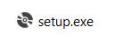
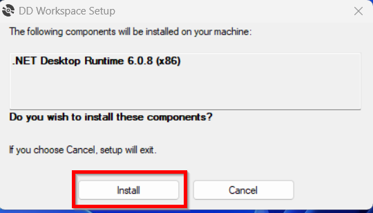

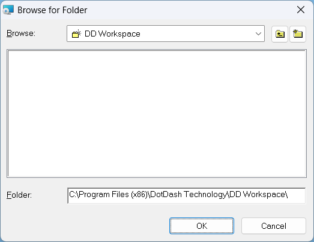
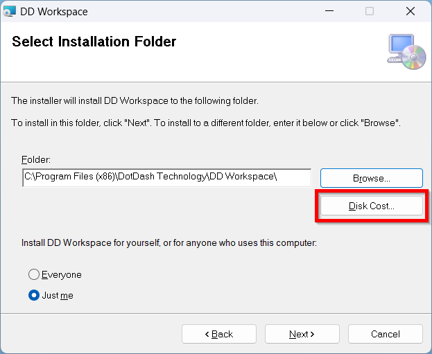
.. |image8| image:: media/image8.png
   :width: 3.1287in
   :height: 0.77067in
.. |image9| image:: media/image9.png
   :width: 2.86979in
   :height: 0.69236in
.. |image10| image:: media/image10.png
   :width: 2.91667in
   :height: 0.72708in

.. |image12| image:: media/image12.png
   :width: 5.68229in
   :height: 3.0207in
.. |image13| image:: media/image13.png
   :width: 5.69271in
   :height: 3.03308in

.. |image18| image:: media/image18.png
   :width: 6.43922in
   :height: 3.43495in
.. |image19| image:: media/image19.png
   :width: 6.20313in
   :height: 3.30494in
.. |image20| image:: media/image20.png
   :width: 6.08854in
   :height: 3.24381in
.. |image21| image:: media/image21.png
   :width: 6.39202in
   :height: 3.40981in
.. |image22| image:: media/image22.png
   :width: 6.40729in
   :height: 3.40994in
.. |image23| image:: media/image23.png
   :width: 6.5in
   :height: 3.47222in
.. |image24| image:: media/image24.png
   :width: 6.5in
   :height: 3.47222in
.. |image25| image:: media/image25.png
   :width: 6.43229in
   :height: 3.42345in
.. |image26| image:: media/image26.png
   :width: 6.34896in
   :height: 3.38125in

.. |image28| image:: media/image28.png
   :width: 6.5in
   :height: 3.47222in

.. |image32| image:: media/image32.png
   :width: 6.03646in
   :height: 3.21197in

.. |image34| image:: media/image34.png
   :width: 6.5in
   :height: 3.47222in
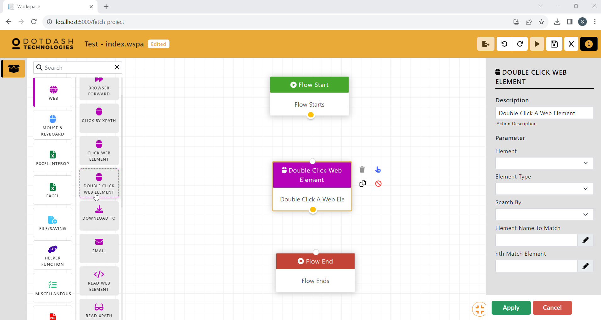
.. |image36| image:: media/image36.png
   :width: 6.5in
   :height: 3.47222in

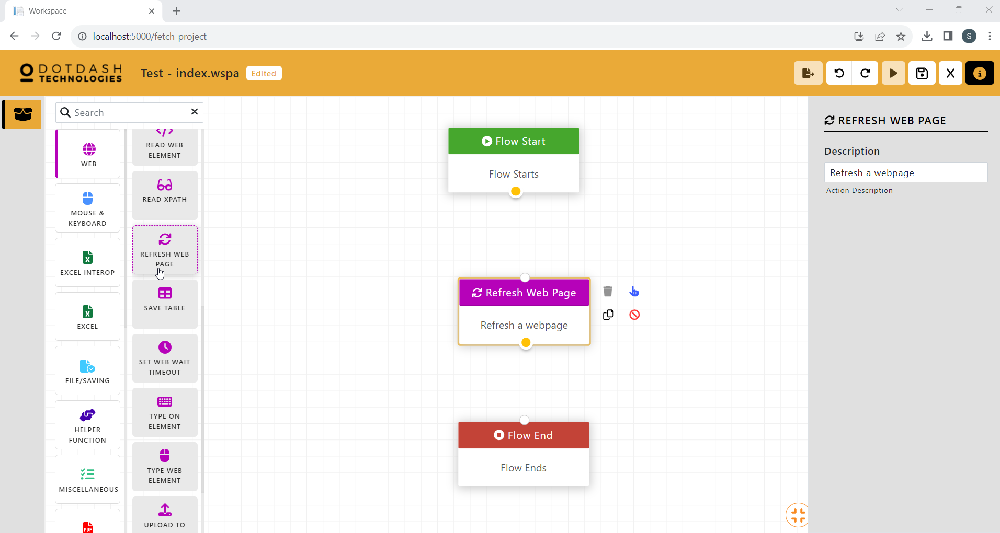
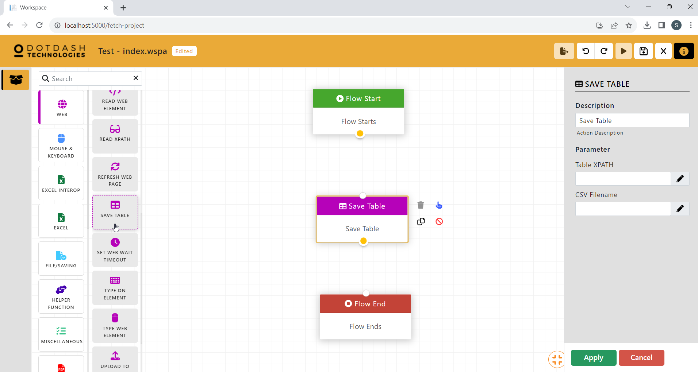
.. |image42| image:: media/image42.png
   :width: 6.5in
   :height: 3.47222in
.. |image43| image:: media/image43.png
   :width: 6.5in
   :height: 3.47222in
.. |image44| image:: media/image44.png
   :width: 6.5in
   :height: 3.47222in
.. |image45| image:: media/image45.png
   :width: 6.5in
   :height: 3.47222in

.. |image47| image:: media/image47.png
   :width: 6.5in
   :height: 3.47222in
.. |image48| image:: media/image48.png
   :width: 6.5in
   :height: 3.47222in

.. |image52| image:: media/image52.png
   :width: 6.5in
   :height: 3.47222in
.. |image53| image:: media/image53.png
   :width: 6.5in
   :height: 3.47222in
.. |image54| image:: media/image54.png
   :width: 6.5in
   :height: 3.47222in
.. |image55| image:: media/image55.png
   :width: 6.5in
   :height: 3.47222in

.. |image57| image:: media/image57.png
   :width: 6.5in
   :height: 3.47222in
.. |image58| image:: media/image58.png
   :width: 6.5in
   :height: 3.47222in

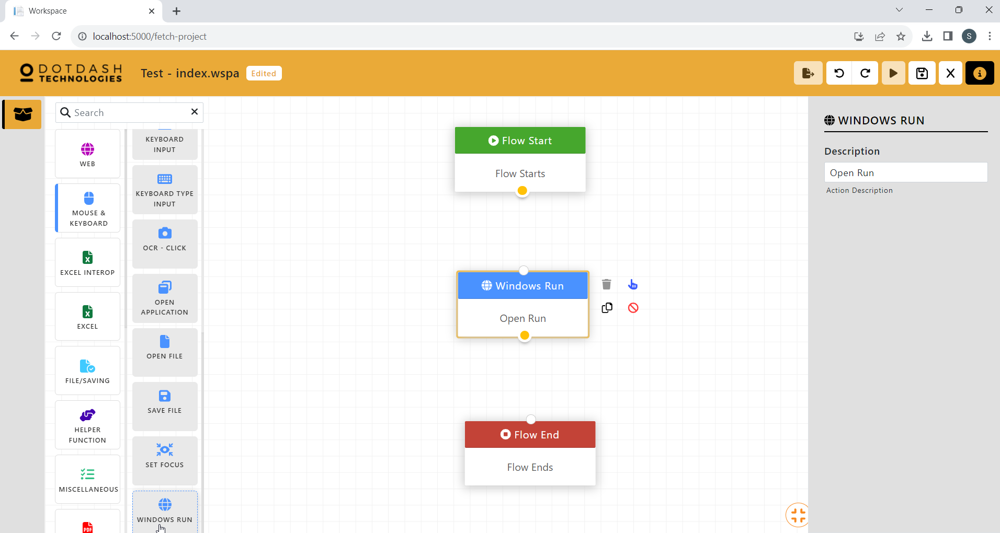
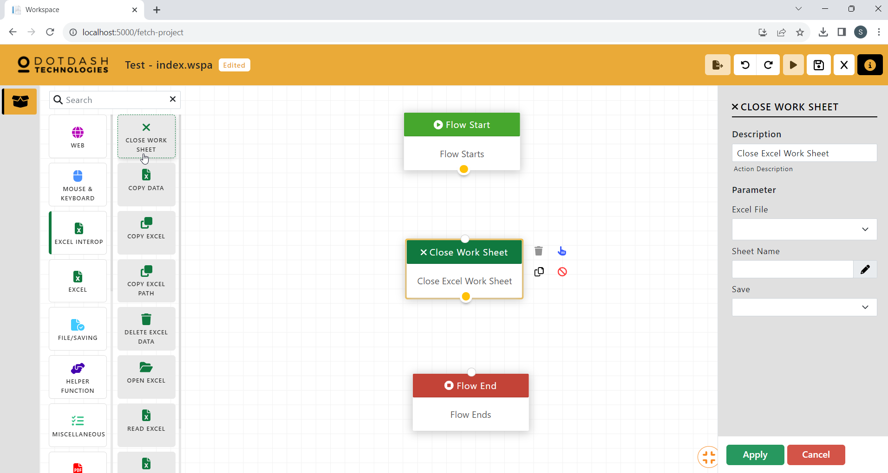

.. |image65| image:: media/image65.png
   :width: 6.5in
   :height: 3.47222in
.. |image66| image:: media/image66.png
   :width: 6.5in
   :height: 3.47222in
.. |image67| image:: media/image67.png
   :width: 6.5in
   :height: 3.47222in
.. |image68| image:: media/image68.png
   :width: 6.5in
   :height: 3.47222in

.. |image70| image:: media/image70.png
   :width: 6.5in
   :height: 3.47222in
.. |image71| image:: media/image71.png
   :width: 6.5in
   :height: 3.47222in
.. |image72| image:: media/image72.png
   :width: 6.5in
   :height: 3.47222in
.. |image73| image:: media/image73.png
   :width: 6.5in
   :height: 3.47222in

.. |image75| image:: media/image75.png
   :width: 6.19271in
   :height: 3.29181in

.. |image78| image:: media/image78.png
   :width: 6.23212in
   :height: 3.32099in

.. |image82| image:: media/image82.png
   :width: 6.5in
   :height: 3.47222in
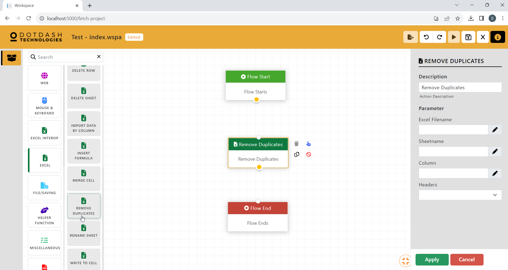
.. |image84| image:: media/image84.png
   :width: 6.5in
   :height: 3.47222in

.. |image86| image:: media/image86.png
   :width: 6.5in
   :height: 3.47222in

.. |image88| image:: media/image88.png
   :width: 6.5in
   :height: 3.47222in
.. |image89| image:: media/image89.png
   :width: 6.5in
   :height: 3.47222in
.. |image90| image:: media/image90.png
   :width: 6.5in
   :height: 3.47222in

.. |image94| image:: media/image94.png
   :width: 6.5in
   :height: 3.47222in
.. |image95| image:: media/image95.png
   :width: 6.5in
   :height: 3.47222in

.. |image97| image:: media/image97.png
   :width: 6.5in
   :height: 3.47222in

.. |image101| image:: media/image101.png
   :width: 6.5in
   :height: 3.47222in

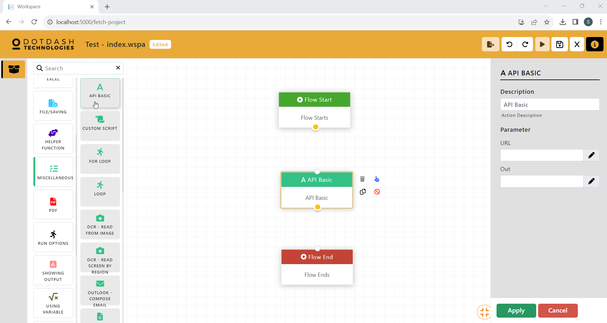
.. |image104| image:: media/image104.png
   :width: 6.5in
   :height: 3.47222in
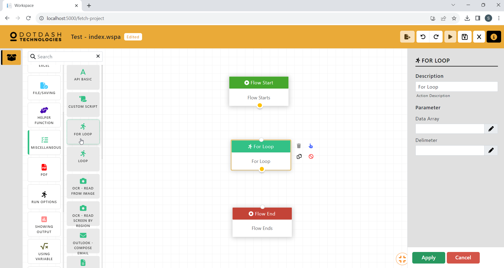
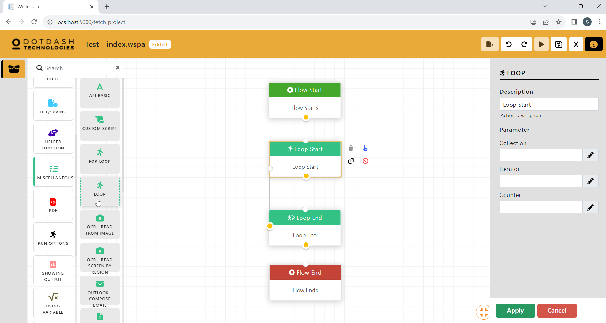
.. |image107| image:: media/image107.png
   :width: 6.28646in
   :height: 3.34867in

.. |image109| image:: media/image109.png
   :width: 6.5in
   :height: 3.47222in
.. |image110| image:: media/image110.png
   :width: 6.5in
   :height: 3.47222in
.. |image111| image:: media/image111.png
   :width: 6.5in
   :height: 3.47222in
.. |image112| image:: media/image112.png
   :width: 6.5in
   :height: 3.47222in
.. |image113| image:: media/image113.png
   :width: 6.5in
   :height: 3.47222in

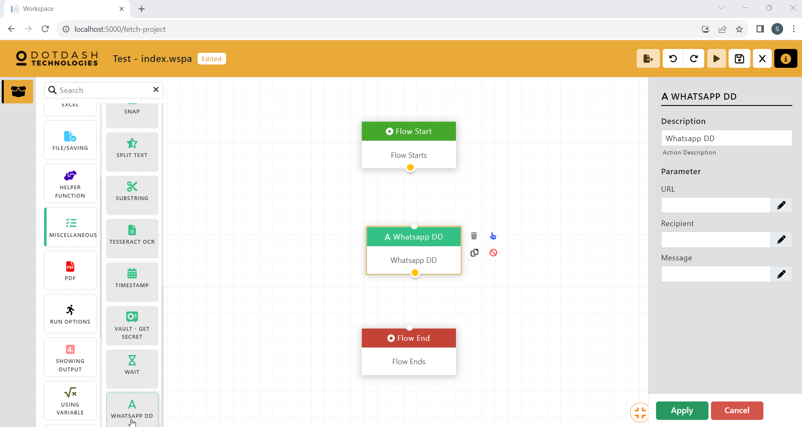
.. |image120| image:: media/image120.png
   :width: 6.5in
   :height: 3.47222in
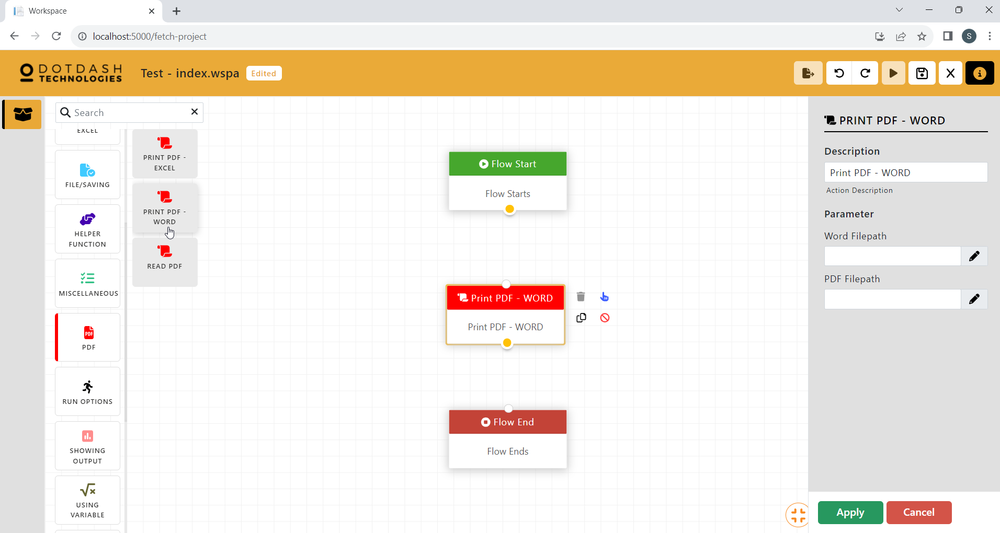
.. |image122| image:: media/image122.png
   :width: 6.5in
   :height: 3.47222in
.. |image123| image:: media/image123.png
   :width: 6.5in
   :height: 3.47222in

.. |image125| image:: media/image125.png
   :width: 6.5in
   :height: 3.47222in

.. |image127| image:: media/image127.png
   :width: 6.45742in
   :height: 4.58435in
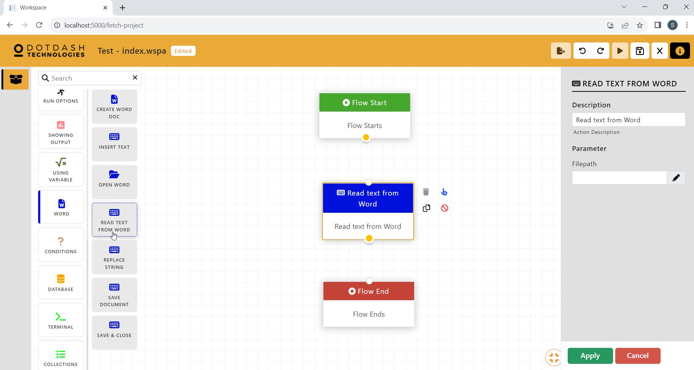
.. |image129| image:: media/image129.png
   :width: 6.56134in
   :height: 3.36243in

.. |image133| image:: media/image133.png
   :width: 2.78935in
   :height: 3.42028in

.. |image135| image:: media/image135.png
   :width: 6.5in
   :height: 3.31944in

.. |image137| image:: media/image137.png
   :width: 6.5in
   :height: 3.31944in
.. |image138| image:: media/image138.png
   :width: 6.5in
   :height: 3.31944in
.. |image139| image:: media/image139.png
   :width: 6.5in
   :height: 3.27778in

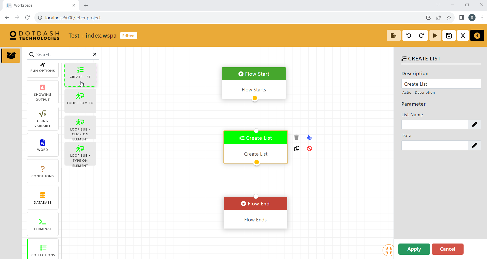

.. |image145| image:: media/image145.png
   :width: 3.18229in
   :height: 1.79004in
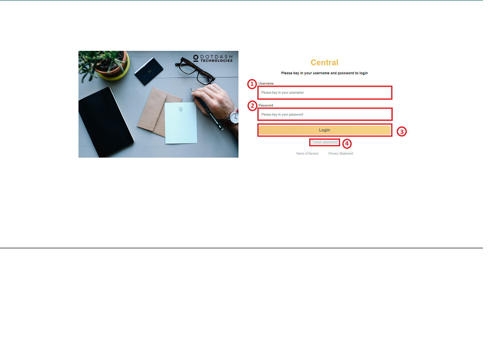
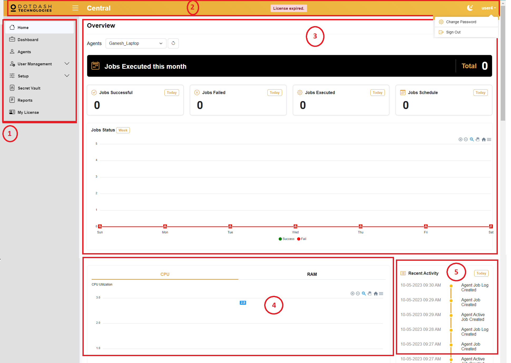

.. |image149| image:: media/image149.png
   :width: 3.1875in
   :height: 1.84375in
