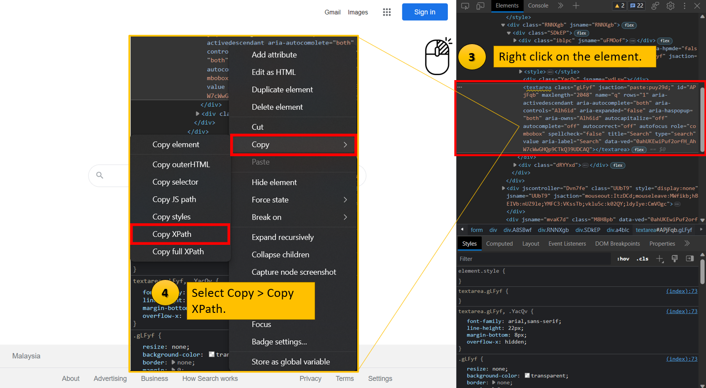

Frequently Asked Questions (FAQ)
================================

1. Excel functions cannot work?

..

   Ans: You can try using keyboard actions. For example,

-  ALT+H+A+C is able to invoke a text center in a cell.

-  F5 or CTRL+G is able to select for a cell or cell range.

-  Every action keys such as F5, CTRL, ALT need to put the square
   brackets [actionkey]

2. If else action cannot be used ? For loop action cannot be used ?

..

   Ans: Use Custom Script action.

3. How to get the Windows Name for Set Focus action?

..

   Ans: Open PowerShell in your machine and type in Get-Process \|
   Where-Object {$\_.mainWindowTitle} \| Format-Table Id, Name,
   mainWindowtitle -AutoSize. / You can also hover at the icon of the
   open application in the taskbar to see the windows name.

4. How to get time or date on the automation process?

..

   Ans: Use Timestamp action. If need to get a previous date, month or
   year can use Run Python or Run Js and insert the code.

5. How to print out/get the result of the Run Python action?

..

   Ans: You can use \`py_result\`. [Note: Should use with the backtick
   symbol (\`)]

6. How to get XPath for click/type/read element action?

..

   Ans: You can right click on the web element and select Inspect. Or,
   you can just press the F12 button on the keyboard. You can see the
   example in `Section - Getting XPath <#section---getting-xpath>`__ for
   complete flow for getting XPath.

7. Excel Permission Denied?

..

   Ans: If you are using the “EXCEL” actions, the excel file needs to be
   closed. For “EXCEL INTEROP” will open the excel file and do the
   actions, the excel file is ok to be opened.

8. Set Value Action

..

   Ans: Input with double quotes, “<text>” is string, without double
   quotes, <text> is variable.

9. Echo

..

   Ans: “ECHO” is to echo what is stored inside the variable, “ECHO
   TEXT” is to echo string/plain text.

10. Central scheduled task constantly in queue even though no other task
    is scheduled?

..

   Ans: Go to the system tray, right-click on the bot icon and click
   “Cancel All Job”. Reschedule task and it should run without any
   problem.

Section - Getting Xpath
-----------------------

Step 1: For this case, I will click on the search bar.

|image1|

Step 2: Copy XPath.

|image2|

Now we get the XPath for Search Field: //\*[@id="APjFqb"]. More
information about XPath: `XPath
Syntax <https://www.w3schools.com/xml/xpath_syntax.asp>`__

.. |image2| image:: media/image2FAQ.png
   :width: 6.5in
   :height: 3.56944in
