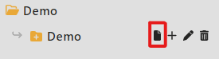
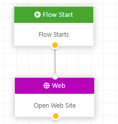
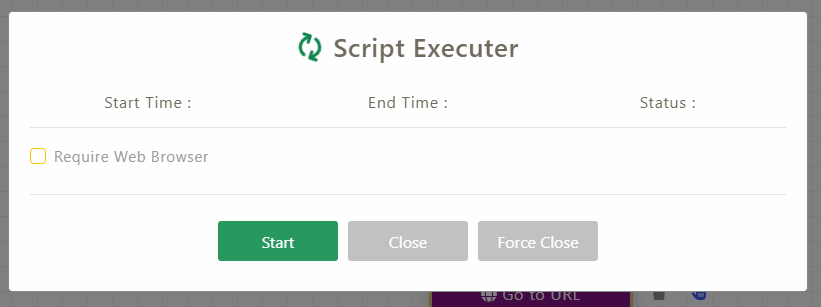
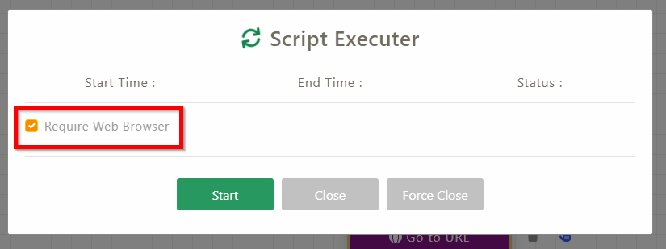
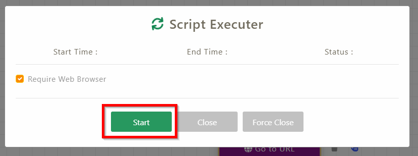
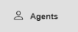
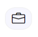

Getting Started
===============

Quick Overview
--------------

The image shown below is the user interface for the Workspace.

|image13|

+----+------------+---------------------------------------------------+
| 1. | File Name  | File name that you are editing.                   |
+----+------------+---------------------------------------------------+
| 2. | Projects & | Projects & Files that you created.                |
|    | Files      |                                                   |
+----+------------+---------------------------------------------------+
| 3. | Action Bar | Different automation’s actions.                   |
+----+------------+---------------------------------------------------+
| 4. | Canvas     | Drag a required action from the action bar to the |
|    |            | canvas to start your automation.                  |
+----+------------+---------------------------------------------------+
| 5. | Buttons    | **Export**                                        |
|    |            |                                                   |
|    |            | Export current canvas file as ddp file and use    |
|    |            | this ddp file to schedule on central.             |
|    |            |                                                   |
|    |            | **Undo**                                          |
|    |            |                                                   |
|    |            | Undo the canvas.                                  |
|    |            |                                                   |
|    |            | **Redo**                                          |
|    |            |                                                   |
|    |            | Redo the canvas.                                  |
|    |            |                                                   |
|    |            | **Run**                                           |
|    |            |                                                   |
|    |            | Run the actions on canvas.                        |
|    |            |                                                   |
|    |            | **Save**                                          |
|    |            |                                                   |
|    |            | Save the actions connected on canvas.             |
|    |            |                                                   |
|    |            | **Close**                                         |
|    |            |                                                   |
|    |            | Close current canvas.                             |
|    |            |                                                   |
|    |            | **Information**                                   |
|    |            |                                                   |
|    |            | About the Workspace.                              |
+----+------------+---------------------------------------------------+

Creating and Running RPA Workflow
---------------------------------

Create New Project
~~~~~~~~~~~~~~~~~~

1. Click on the “Create New Project” button located on the top left side
   of the website.

..

   |image14|

2. A new project will be created under the “Create New Project” button.
   Enter a name into the text field and press “enter”.

..

   |image15|

3. Click on the newly created project once to show its content. Hover
   the mouse over the project and click the “+” button that is on the
   right of the project name.

..

   |image16|

4. Enter the new folder’s name in the text field and press “enter”

..

   |image17|

5. Click on the “New Workspace” button to create a new workspace.

..

   |image18|

Create New Workflow
~~~~~~~~~~~~~~~~~~~

1. Drag out the required actions from the action bar to the canvas.

2. Connect two actions by dragging from the yellow circle of the first
   action to the white circle of the second action.

..

   |image19|

3. Repeat the step 1 to 2 until all actions have been added to the
   workflow. Then connect the last action to the “Flow End” action.

4. Click the “save” button to save the workflow. If it is saved
   successfully, the run button and export button will become clickable
   and not greyed out.

..

   |image20|

Run Workflow
~~~~~~~~~~~~

1. To run the workflow, click the “run” button next to the “save”
      button.

..

   |image21|

2. A pop-up will appear.

..

   |image22|

3. Tick the “Require Web Browser” option if browser is used in the
      workflow

..

   |image23|

4. Click on the “Start” button and the workflow will start.

..

   |image24|

Schedule a Process
------------------

1. Open Central.

2. Go to “Agents” page.

|image25|

3. Click on the “New Job” button of a Bot.

|image26|

4.  Create a new project.

5.  Create a new folder.

6.  Upload the ddp file to the folder.

7.  Drag and drop the ddp file from folder to the right side.

8.  Fill in required information.

9.  Click “Save” button.

10. Close the “New Job” screen.

Viewing the Process in Schedule
-------------------------------

1. Click on the “Schedule Job” button.

|image27|

2. A list of job that have been scheduled will be listed here.

.. |image13| image:: media/image13.png
   :width: 5.21795in
   :height: 2.55894in
.. |image14| image:: media/image14.png
   :width: 1.84717in
   :height: 1.23734in
.. |image15| image:: media/image15.png
   :width: 2.37277in
   :height: 0.45897in
.. |image16| image:: media/image16.png
   :width: 2.43862in
   :height: 0.4094in
.. |image17| image:: media/image17.png
   :width: 2.31283in
   :height: 0.62849in

.. |image20| image:: media/image20.png
   :width: 3.2317in
   :height: 0.79605in
.. |image21| image:: media/image21.png
   :width: 3.21967in
   :height: 0.77677in

.. |image27| image:: media/image27.png
   :width: 0.60839in
   :height: 0.57505in