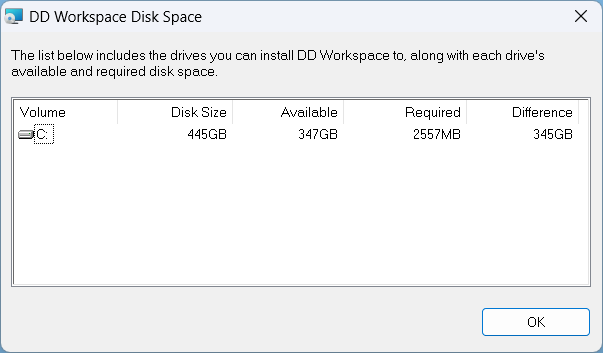
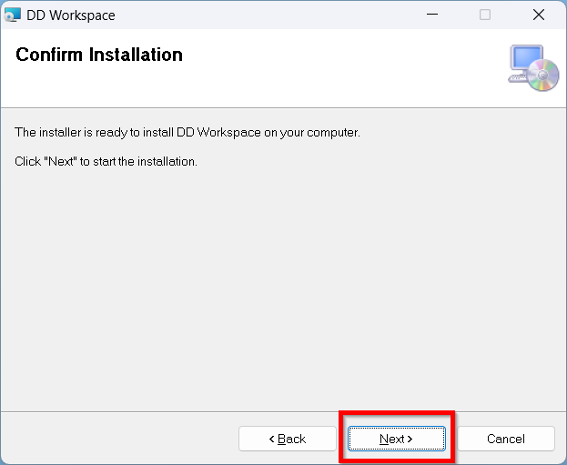
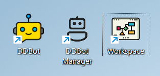

Installation
============

The installation file can be downloaded as msi installer file from
DotDash Technologies official website. The DD-Workspace installation
file includes Workspace and Bot component in one installer.

Before you begin the installation procedure for Windows, please review
the System Requirements and Other pre-requisites.

To install the Workspace

1. Download the installer from the official website

2. Unzip the zip file to a folder in your local PC

3. Execute the installer file as Administrator

|image2|

4. Click to “Install” the required .Net Desktop Runtime

|image3|

5. If prompted for permission to install the component, click “Yes” or
   “Allow”

6. A setup wizard will appear once the .Net Desktop Runtime finished
   installed.

7. Click “Next” to proceed with the setup

..

   |image4|

8. Click “Browse” to change the folder if required. A new popup will
   appear that allow user to select folder.

..

   |image5| |image6|

9. Click “Disk Cost” to see the size required and available size on all
   the storage drive

..

   |image7| |image8|

10. Click “Next” to proceed with the installation

..

   |image9|

11. Click “Next” to start the installation

..

   |image10|

12. Click “Yes” if prompt for permission

13. Wait for installation to finish

14. Click “Close” once the installation is completed

..

   |image11|

15. The installation is now completed and three new icons should appear
    on the desktop.

..

   |image12|

.. |image2| image:: media/image2.png
   :width: 1.75231in
   :height: 0.56026in
.. |image3| image:: media/image3.png
   :width: 3.37111in
   :height: 1.875in
.. |image4| image:: media/image4.png
   :width: 3.15in
   :height: 2.56893in
.. |image5| image:: media/image5.png
   :width: 2.69792in
   :height: 2.16667in
.. |image6| image:: media/image6.png
   :width: 2.83333in
   :height: 2.17708in
.. |image7| image:: media/image7.png
   :width: 2.31667in
   :height: 1.90664in

.. |image9| image:: media/image9.png
   :width: 3.39583in
   :height: 2.76042in

.. |image11| image:: media/image11.png
   :width: 3.94792in
   :height: 3.23958in
