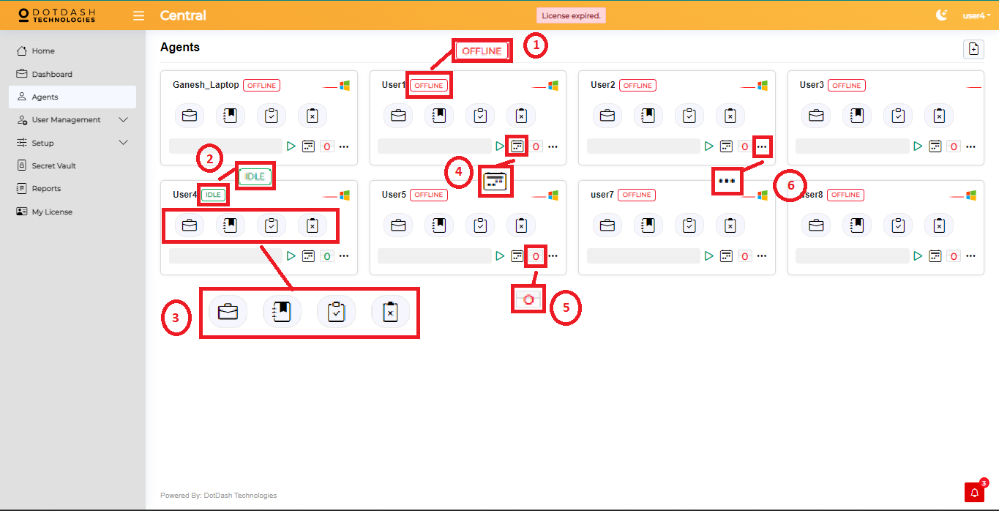
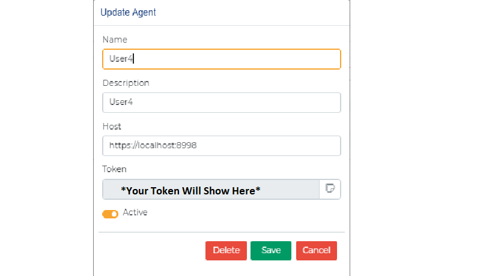
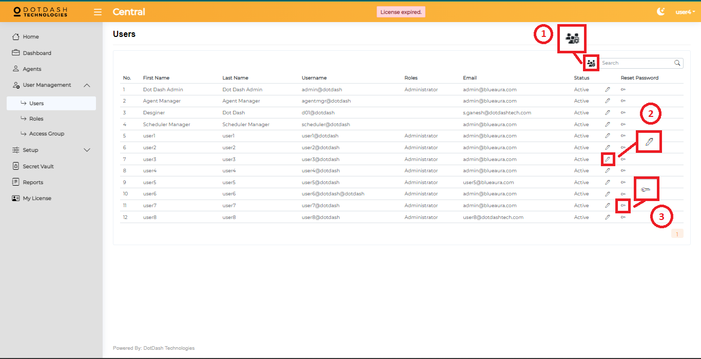
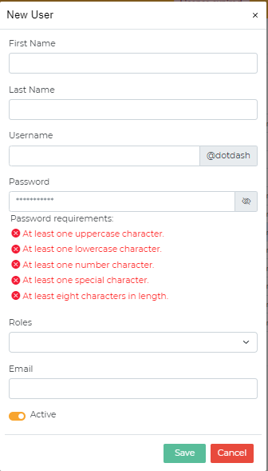
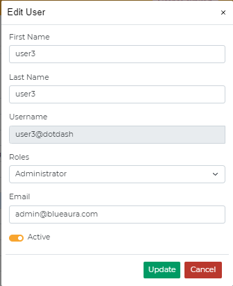
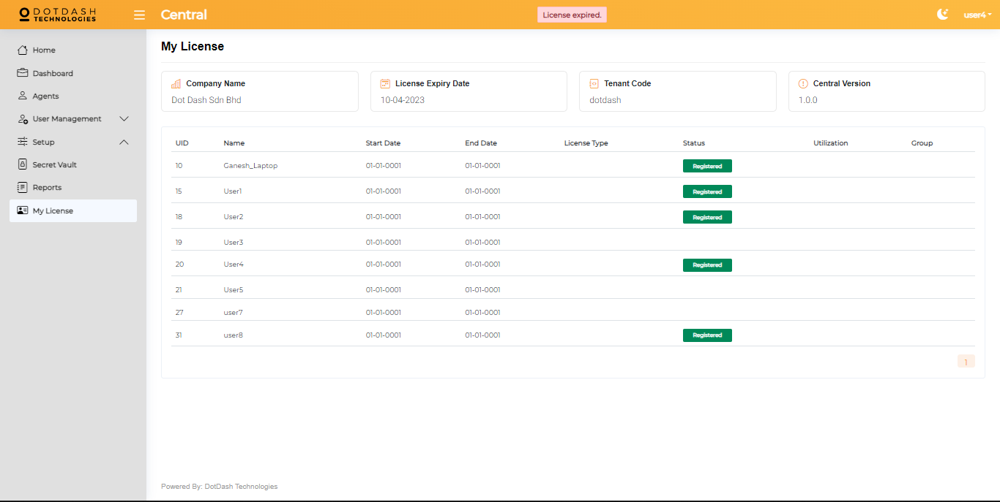

Using Central
=============

.. _quick-overview-2:

Quick Overview
--------------

Central is a website that the user can use to schedule their workflow to
be run automatically on a device at the scheduled time.

To access Central, go to the website:
https://centralapps.azurewebsites.net/login

.. _login-1:

Login
-----

Key in your username and password then press login.

|image150|

+----+--------------+--------------------------------------------------+
| 1. | Username     | Type your Central username.                      |
+----+--------------+--------------------------------------------------+
| 2. | Password     | Type your Central password.                      |
+----+--------------+--------------------------------------------------+
| 3. | Login        | Click Login after you have typed in your         |
|    |              | username and password.                           |
+----+--------------+--------------------------------------------------+
| 4. | Forgot       | Redirect you to change your password.            |
|    | Password     |                                                  |
+----+--------------+--------------------------------------------------+

Home
----

You will be redirected to this Home Page. This page is to let you see
what the status of the bot runs on one day.

|image151|

+-------+----------+---------------------------------------------------+
| 1.    | Sidebar  | You are able to go to another page by clicking    |
|       |          | the page you want to go to, then you will be      |
|       |          | redirected to the page.                           |
+-------+----------+---------------------------------------------------+
| 2.    | Na       | Navigation bar only lets you do some basic        |
|       | vigation | functions such as hide the sidebar by clicking    |
|       | bar      | the menu icon on the left side of the “Central”.  |
|       |          | Other than that, you are able to change the whole |
|       |          | UI from light mode to dark mode by clicking the   |
|       |          | moon icon. The right side of the moon icon is     |
|       |          | your username, after clicking it you can change   |
|       |          | your account password or sign out your account.   |
+-------+----------+---------------------------------------------------+
| 3.    | Overview | This part is to see all the tasks status that ran |
|       |          | on your bot.                                      |
+-------+----------+---------------------------------------------------+
| 4.    | Util     | Here you can see your laptop’s CPU utilization    |
|       | izations | and also RAM utilization after your laptop ran    |
|       |          | the tasks.                                        |
+-------+----------+---------------------------------------------------+
| 5.    | Recent   | This is the activity where someone makes changes  |
|       | Activity | on the Agents page.                               |
+-------+----------+---------------------------------------------------+

Dashboard
---------

This page lets you see what tasks are the tasks that run on each bot.

|image152|

+-----+-----------------+----------------------------------------------+
| 1.  | Force Cancel &  | These two functions need you to check one of |
|     | Force Complete  | the items or check all the items before you  |
|     |                 | force cancel or force complete.              |
+-----+-----------------+----------------------------------------------+
| 2.  | Actions         | **Show Details**                             |
|     |                 |                                              |
|     |                 | To show what task’s status. For example, was |
|     |                 | the task submitted, was the task completed,  |
|     |                 | was task running, was the task having error  |
|     |                 | or was the task queuing.                     |
+-----+-----------------+----------------------------------------------+
|     |                 | **Show Output**                              |
|     |                 |                                              |
|     |                 | To show the output of the task’s running     |
|     |                 | flow.                                        |
+-----+-----------------+----------------------------------------------+
|     |                 | **Force Cancel**                             |
|     |                 |                                              |
|     |                 | If you want the task to be cancelled, you    |
|     |                 | can cancel the job.                          |
+-----+-----------------+----------------------------------------------+
|     |                 | **Force Complete**                           |
|     |                 |                                              |
|     |                 | Is almost the same as force cancel because   |
|     |                 | you can force stop the running job.          |
+-----+-----------------+----------------------------------------------+
|     |                 | **Acknowledgement**                          |
|     |                 |                                              |
|     |                 | You can write remarks for the task.          |
+-----+-----------------+----------------------------------------------+
| 3.  | Download Report | **PDF**                                      |
|     |                 |                                              |
|     |                 | Download the report as PDF format.           |
|     |                 |                                              |
|     |                 | **CSV**                                      |
|     |                 |                                              |
|     |                 | Download the report as CSV format.           |
+-----+-----------------+----------------------------------------------+

Agents
------

This page is the page to schedule your jobs.

|image153|

+----+---------+------------------------------------------------------+
| 1. | OFFLINE | If your bot is not opened, your user’s agent will    |
|    |         | show you that you are offline.                       |
+----+---------+------------------------------------------------------+
| 2. | IDLE    | If your bot is online, you will see the green color  |
|    |         | border and green color IDLE text beside your bot’s   |
|    |         | name.                                                |
+----+---------+------------------------------------------------------+
| 3. | Actions | **New Job**                                          |
|    |         |                                                      |
|    |         | To create a new job that you want to schedule.       |
+----+---------+------------------------------------------------------+
|    |         | **Schedule Job**                                     |
|    |         |                                                      |
|    |         | To see what tasks or jobs that you scheduled.        |
+----+---------+------------------------------------------------------+
|    |         | **Result**                                           |
|    |         |                                                      |
|    |         | To see what are the output of the jobs or tasks you  |
|    |         | created. Failed or completed or even queuing.        |
+----+---------+------------------------------------------------------+
|    |         | **Failed**                                           |
|    |         |                                                      |
|    |         | To see what are the failed jobs or tasks.            |
+----+---------+------------------------------------------------------+
| 4. | Today's | This will show you the job that needs to run today.  |
|    | Job     |                                                      |
+----+---------+------------------------------------------------------+
| 5. | Co      | This countdown is set to 10 seconds and it will      |
|    | untdown | refresh the bot’s card every 10 seconds.             |
+----+---------+------------------------------------------------------+
| 6. | More    | After clicking the more button, it will have a pop   |
|    |         | up that shows your agent’s details.                  |
+----+---------+------------------------------------------------------+

|image154|

More Button Pop up

User Management
---------------

Users
~~~~~

This page is all the users that are registered to the central.

|image155|

+---+-----------------+-----------------------------------------------+
| 1 | Add New User    | After clicking the add new user, it will pop  |
| . |                 | up to let you write all the information.      |
+---+-----------------+-----------------------------------------------+
| 2 | Edit User       | It will have a pop up to let you edit the     |
| . |                 | user, by clicking the pen button.             |
+---+-----------------+-----------------------------------------------+
| 3 | Change Password | It will have a pop up to let you change the   |
| . |                 | password of the central.                      |
+---+-----------------+-----------------------------------------------+

|image156|

Add New User Pop Up

|image157|

Edit User Pop Up

|image158|

Change Password Pop Up

Roles
~~~~~

This page is to create and edit user roles.

|image159|

+---+----------------------+------------------------------------------+
| 1 | Edit                 | Edit the name of the role.               |
| . |                      |                                          |
+---+----------------------+------------------------------------------+
| 2 | Delete               | Delete the role that you do not want.    |
| . |                      |                                          |
+---+----------------------+------------------------------------------+
| 3 | Access Group         | Assign what access group that the role   |
| . |                      | can access.                              |
+---+----------------------+------------------------------------------+

|image160|

Role Access Group Pop Up

Access Group
~~~~~~~~~~~~

This page is to assign the page to which the users can access to what
page.

|image161|

+----+---------------------+------------------------------------------+
| 1. | Add new access      | Add a new access group for different     |
|    | group               | users.                                   |
+----+---------------------+------------------------------------------+
| 2. | Edit                | Edit the name and description to specify |
|    |                     | different access groups.                 |
+----+---------------------+------------------------------------------+
| 3. | Pages               | Assign different pages to different      |
|    |                     | access groups to let the users of the    |
|    |                     | access group only can access those       |
|    |                     | pages.                                   |
+----+---------------------+------------------------------------------+

Setup
-----

Public Holiday
~~~~~~~~~~~~~~

   This page is to set the public holiday to let the bot know which day
   is a public holiday.\ |image162|

+-----+----------------+----------------------------------------------+
| 1.  | Add public     | You can add a public holiday to here to let  |
|     | holiday        | the bot know the day is a public holiday. If |
|     |                | you set a public holiday then the bot will   |
|     |                | not run on that day unless you click run on  |
|     |                | the public holiday on the “Agents” page >    |
|     |                | New job.                                     |
+-----+----------------+----------------------------------------------+
| 2.  | Edit           | Edit the details of the public holiday you   |
|     |                | set.                                         |
+-----+----------------+----------------------------------------------+
| 3.  | Delete         | Delete the public holiday you have set.      |
+-----+----------------+----------------------------------------------+

Mailing List
~~~~~~~~~~~~

   This page is to set a group to put a list of emails.\ |image163|

+------+---------------------+-----------------------------------------+
| 1.   | Add new mailing     | You can add a new mailing list to put   |
|      | list                | more than one email inside the mailing  |
|      |                     | list. You are able to choose a mailing  |
|      |                     | list on the “Agents” page > New Job. It |
|      |                     | will send the error message to all the  |
|      |                     | lists of emails inside the mailing      |
|      |                     | list.                                   |
+------+---------------------+-----------------------------------------+
| 2.   | Show details        | After you click on this show details    |
|      |                     | button It will show you a list of       |
|      |                     | emails that are inside a mailing list.  |
|      |                     |                                         |
|      |                     | More information of this will be shown  |
|      |                     | in the next section.                    |
+------+---------------------+-----------------------------------------+
| 3.   | Edit                | Edit the name and description to        |
|      |                     | specify a different mailing list.       |
+------+---------------------+-----------------------------------------+
| 4.   | Delete              | Delete the unwanted mailing list.       |
+------+---------------------+-----------------------------------------+

Show Details
^^^^^^^^^^^^

   This page is to put your email that you want the error message to be
   sent to.\ |image164|

+-----+---------------+------------------------------------------------+
| 1.  | Add new email | Add a new email that you want the error        |
|     |               | message to be sent to.                         |
+-----+---------------+------------------------------------------------+
| 2.  | Email         | This email will receive the error message if   |
|     |               | the job or task was failed.                    |
+-----+---------------+------------------------------------------------+
| 3.  | Edit          | Edit the name, description and email.          |
+-----+---------------+------------------------------------------------+
| 4.  | Delete        | Delete the email you don't want the error      |
|     |               | message to send to.                            |
+-----+---------------+------------------------------------------------+

Secret Vault
------------

This page is to put your secret, password or something that you want it
to be hidden. Workspace has the action called “Vault - Get Secret”, this
action will get what secret set on this page.\ |image165|

+----+-------------------+---------------------------------------------+
| 1. | Add new secret    | You can add a new secret to hide and use on |
|    |                   | workspace’s action.                         |
+----+-------------------+---------------------------------------------+
| 2. | Edit secret       | Edit the secret you want to change, change  |
|    |                   | the secret or envelope or even the key.     |
+----+-------------------+---------------------------------------------+
| 3. | Delete secret     | Delete the unwanted secret.                 |
+----+-------------------+---------------------------------------------+

Reports
-------

This page is to generate reports of different parts.\ |image166|

+------+---------+-----------------------------------------------------+
| 1.   | Get     | **Print**                                           |
|      | Report  |                                                     |
|      |         | You can print out the report you want.              |
|      |         |                                                     |
|      |         | **HTML**                                            |
|      |         |                                                     |
|      |         | Download the report as HTML format.                 |
|      |         |                                                     |
|      |         | **PDF**                                             |
|      |         |                                                     |
|      |         | Download the report as PDF format.                  |
+------+---------+-----------------------------------------------------+
| 2.   | Reports | You can get different parts of the reports. For     |
|      |         | example, Agents, Job Definitions, Users and Run     |
|      |         | Jobs reports.                                       |
+------+---------+-----------------------------------------------------+

License
-------

This page is to review the central details.\ |image167|

You are able to review the company name, license expiry date, tenant
code and central version. Other than that, you are also able to review
all the users license status.

.. |image150| image:: media/image146.png
   :width: 5.78267in
   :height: 2.94694in
.. |image151| image:: media/image147.png
   :width: 6.15976in
   :height: 4.37304in
.. |image152| image:: media/image148.png
   :width: 5.73166in
   :height: 2.96381in

