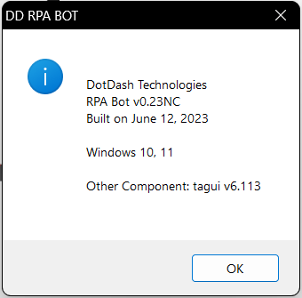
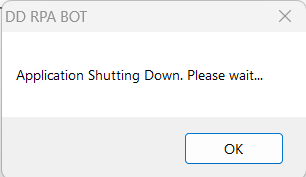

Using DDBot
===========

.. _quick-overview-3:

Quick Overview
--------------

DDBot is the application that will connect to the Central and trigger
workflow that needs to be run.

Run DDBot
---------

1. Double click the DDBot icon

..

   |image168|

2. An icon will appear in the hidden icon tray.

..

   |image169|

3. Double click the DDBot Manager icon

..

   |image170|

4. A command prompt will appear, minimize it.

5. In Central, the bot status should become “Idle”.

..

   |image171|

Additional Functions
--------------------

Right-click the DDBot icon in the hidden icon tray to get the option as
shown below.

|image172|

1. **About**: This is just showing you the bot’s details.
|
..
   |image173|

2. **Documentation**: Redirect you to the DotDash Technologies website.

3. **Support**: You will see a pop-up message showing you the support details.
|
..
   |image174|

4. **Cancel All Job**: If your job results are showing you the job is in
   queue and the job does not start, there might be any hidden job not
   completely run but you are not able to see it, you can just click
   this cancel all jobs to cancel all the jobs that are stuck.

5. **Stop Apps**: Stop the bot and you will see the pop-up message. You
   can just leave it until it auto closes.

..

   |image175|

6. **Kill**: Kill is to kill the bot and close the bot, it will close
   the bot and not pop up a message.

.. |image172| image:: media/image168.png
   :width: 1.88725in
   :height: 1.52553in

